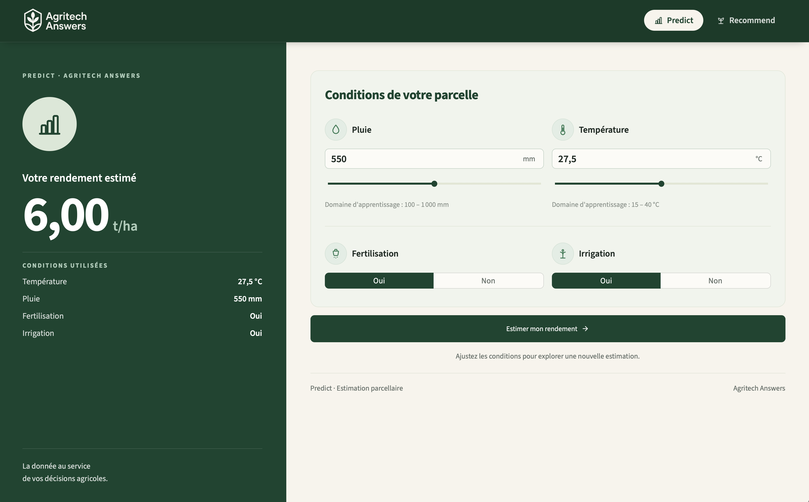
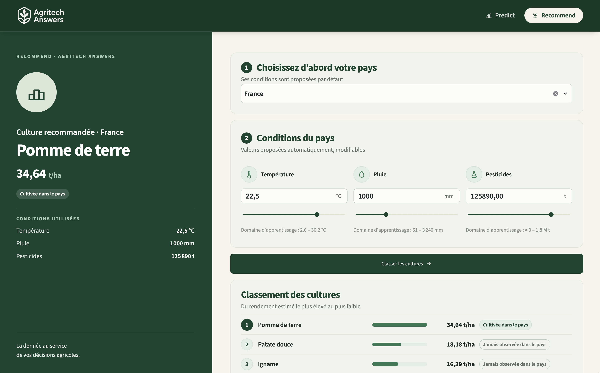

# Projet 12 : Concevez un système de recommandations pour une agriculture optimisée par les données

      

> Agritech Answers propose deux services d'aide à la décision agricole : estimer le rendement d'une parcelle
(`/predict`) et classer les cultures les plus adaptées à un pays (`/recommend`). Les modèles sont servis par une
API FastAPI. Une interface Streamlit permet d'utiliser les deux services, et un dashboard Gradio suit l'activité
de l'API (volumes, erreurs, latences).

[](https://justinetct.github.io/oc_project12_agritech/rapport_technique.html)

Source : [`docs/rapport_technique.md`](docs/rapport_technique.md)

## Sommaire

- [Objectif métier](#objectif-métier)
- [Démarrage rapide](#démarrage-rapide)
- [Architecture](#architecture)
- [Données](#données)
- [Modèles et résultats](#modèles-et-résultats)
- [Notebooks](#notebooks)
- [Tests et qualité](#tests-et-qualité)
- [Docker](#docker)
- [Structure du dépôt](#structure-du-dépôt)
- [Documentation](#documentation)

## Objectif métier

**Predict — estimer un rendement**

- l'utilisateur décrit sa parcelle : pluie, température, fertilisation et irrigation ;
- l'application affiche le rendement estimé en t/ha ;
- si une valeur sort du domaine vu à l'entraînement, l'estimation est affichée avec un avertissement.

<p align="center">
  
</p>

**Recommend — classer les cultures**

- l'utilisateur choisit son pays ;
- la température, la pluie et les pesticides du pays sont proposés par défaut, et restent modifiables ;
- le modèle estime le rendement des 10 cultures, classées du rendement le plus élevé au plus faible.

<p align="center">
  
</p>

## Démarrage rapide

Prérequis : Python 3.12 et [Poetry](https://python-poetry.org/) 2.x.

```bash
poetry install
cp .env.example .env   # facultatif : MLflow, Logfire, base SQLite
```

Les modèles finaux sont versionnés dans `models/` : l'API et l'interface se lancent sans relancer les notebooks.

```bash
make api         # terminal 1 : API sur http://127.0.0.1:8000 (Swagger sur /docs)
make streamlit   # terminal 2 : interface sur http://localhost:8501 (port par défaut de Streamlit)
make gradio      # terminal 3 : dashboard de monitoring sur http://127.0.0.1:7860 (port par défaut de Gradio)
```

Les deux interfaces appellent l'API à l'adresse donnée par `AGRITECH_API_URL`, par défaut
`http://localhost:8000`. Pour utiliser une autre API, il suffit de la définir dans le shell :
`AGRITECH_API_URL=http://mon-serveur:8000 make streamlit`.

Le dashboard Gradio lit les endpoints de monitoring, protégés par un token : `MONITORING_API_TOKEN` doit avoir
la même valeur côté API et côté dashboard (par exemple dans `.env`, lu par les deux au lancement). Sans token,
le dashboard démarre et indique que le monitoring n'est pas configuré.

Avec l'API lancée, `make health`, `make predict` et `make recommend` envoient des requêtes d'exemple.

## Architecture

```
Streamlit (streamlit_app/) ── endpoints métier ───┐
                                                  ├──→ API FastAPI (src/agritech/api/) ──→ modèles (models/*.joblib)
Gradio (gradio_app/) ── endpoints /monitoring ────┘                 │
                                                                    └──→ SQLite de monitoring
```

L'interface Streamlit ne contient aucune logique ML : elle lit les contrats de l'API (bornes, domaines,
pays, cultures, valeurs par défaut), envoie les valeurs saisies et affiche les réponses.

Le dashboard Gradio n'utilise que les endpoints `/monitoring/*`, en HTTP. Il ne lit jamais la base SQLite :
FastAPI en est le seul propriétaire : il archive chaque appel et répond aux lectures du monitoring.

L'API expose cinq endpoints métier :

- `GET /health` : état du service et version du modèle `/predict` ;
- `GET /predict/context` : bornes physiques, domaine d'entraînement et unités de `/predict` ;
- `POST /predict` : rendement estimé à partir des 4 variables du modèle ;
- `GET /recommend/context` : pays, cultures, bornes et domaine de `/recommend` ; avec `?iso3=FRA`, ajoute les
  valeurs par défaut du pays ;
- `POST /recommend` : classement des 10 cultures pour un pays et des conditions facultatives.

et deux endpoints de monitoring, en lecture seule, protégés par l'en-tête `Authorization: Bearer <token>`
(401 si le token est absent ou faux, 503 si `MONITORING_API_TOKEN` n'est pas défini côté API) :

- `GET /monitoring/summary?days=30` : indicateurs de la période (volumes, taux de réussite, erreurs par type,
  latences médiane et max par service, volume quotidien) ;
- `GET /monitoring/requests?limit=20` : derniers appels archivés, filtrables par `service` et `success`.

**Observabilité :**

- chaque `POST /predict` et `POST /recommend` est archivé dans une base SQLite (`data/monitoring/api.sqlite`
  par défaut, configurable avec `DATABASE_URL`) ; le schéma est décrit dans l'[annexe E du rapport](docs/rapport_technique.md#e-schéma-du-monitoring-sqlite) ;
- les appels sont tracés dans Logfire seulement si `LOGFIRE_TOKEN` est défini ; sinon, aucun envoi réseau ;
- une panne de l'observabilité ne fait jamais échouer une prédiction ;
- un appel archivé peut être rejoué avec le modèle actuel : `poetry run python -m agritech.monitoring.replay <id>`
  (ou `--failed --since YYYY-MM-DD`) ;
- pour une démonstration, `make seed-monitoring` montre l'historique de 90 jours qu'il ajouterait à la base ;
  `make seed-monitoring ARGS=--write` l'ajoute, sans rien supprimer (refusé si `ENVIRONMENT=prod`).

## Données

Deux jeux de données, qui ne sont pas fusionnés car ils répondent à deux usages différents :

- **Agriculture CropYield Dataset** → `/predict`. Une ligne par parcelle (1 000 000 lignes brutes) : conditions
  de la parcelle et rendement. Il reste 999 769 lignes pour la modélisation.
- **CropYield Prediction Dataset** → `/recommend`. Une ligne par pays × culture × année. Après assemblage et
  nettoyage : 16 319 lignes, 115 pays, 10 cultures, 1990-2013.

Les données ne sont pas versionnées. Leur provenance, l'arborescence attendue et les détails du nettoyage sont
dans [`data/README.md`](data/README.md).

## Modèles et résultats

### `/predict`

Découpage 80 % / 20 % (799 815 / 199 954 lignes). Les modèles sont comparés par validation croisée à 5 folds
sur l'entraînement ; le jeu de test ne sert qu'à l'évaluation finale.

**Modèle final : `LinearRegression`** avec 4 variables : `Rainfall_mm`, `Temperature_Celsius`,
`Fertilizer_Used` et `Irrigation_Used`. Sur le jeu de test : **RMSE 0,4993 t/ha, MAE 0,3983 t/ha, R² 0,9132**.

Les modèles non linéaires testés (arbres, forêts, boosting), même optimisés, n'ont pas fait mieux que la
régression linéaire. Le modèle est sauvegardé dans `models/predict_model.joblib`.

### `/recommend`

Validation temporelle : chaque année de 2008 à 2012 est prédite par un modèle appris sur les années précédentes.
**2013 est réservée au test final.**

Progression de la RMSE en validation : `DummyRegressor` 8,50 t/ha → `LinearRegression` 5,51 → régression
linéaire avec feature engineering (log des pesticides, effet propre à chaque culture, géographie) 4,67 →
`ExtraTreesRegressor` après tuning 1,43.

**Modèle final : `ExtraTreesRegressor` à 150 arbres** (`max_features=0.9`, `min_samples_split=3`). Variables :
`crop`, `year`, `temp_hist` et `log_pest_hist` (moyennes des 3 années précédentes du pays), `rain_mm` (pluie du
pays), `lat_abs`, `geo_x`, `geo_y` et `geo_z` (position du pays sur le globe). Le code `iso3` n'est pas utilisé.

**Modèle évalué (notebook 15)** : appris sur 1991-2012 (14 941 lignes), évalué une seule fois sur 2013.

| ExtraTrees, 150 arbres | RMSE (t/ha) | MAE (t/ha) | R² |
|---|---:|---:|---:|
| Validation temporelle 2008-2012 | 1,4349 | 0,7114 | 0,9710 |
| Test final 2013 (695 lignes) | 1,6584 | 0,7615 | 0,9638 |

**Modèle servi (notebook 16)** : après l'évaluation, le même modèle, avec les mêmes réglages, est réentraîné
sur toutes les données 1991-2013 (15 636 lignes). Ce refit n'a pas de nouvelle évaluation : les métriques
ci-dessus restent celles du modèle évalué. L'artefact `models/recommend_model.joblib` (`model_version` 2.0.0,
≈ 46,9 Mo) prédit pour l'année cible technique 2014, la première après les données disponibles.

**Limite :** le test 2013 ne contient que des couples pays × culture déjà observés. Il ne mesure donc pas les
cultures jamais cultivées dans le pays, alors que, dans les demandes 2012, 25 des 115 cultures classées n°1
n'avaient jamais été observées dans le pays. Les autres limites sont dans l'[annexe A du rapport](docs/rapport_technique.md#a-limites-et-précautions).

## Notebooks

Les expériences sont suivies dans MLflow (`oc_p12_agritech_predict` et `oc_p12_agritech_recommend`). Les
fichiers de données générés ne sont pas versionnés et se reconstruisent avec les notebooks.

**Exploration et préparation**

- `01_eda_agriculture_crop_yield.ipynb` — exploration du dataset parcelle.
- `02_pca_agriculture_crop_yield.ipynb` — ACP exploratoire du dataset parcelle.
- `03_eda_crop_yield_prediction.ipynb` — exploration des sources historiques.
- `04_build_crop_yield_dataset.ipynb` — assemblage et nettoyage du dataset historique.
- `05_dataset_comparison.ipynb` — comparaison des deux datasets et choix d'un dataset par service.
- `06_prepare_training_dataset.ipynb` — datasets d'entraînement de `/predict` et `/recommend`.

**Modèle `/predict`**

- `07_predict_training_baseline.ipynb` — baseline et comparaison avec une régression linéaire.
- `08_predict_feature_engineering.ipynb` — sélection des variables et feature engineering.
- `09_predict_nonlinear_models.ipynb` — comparaison avec des modèles non linéaires.
- `10_predict_model_tuning.ipynb` — tuning des meilleurs modèles et choix final.
- `11_predict_final_evaluation.ipynb` — évaluation sur le jeu de test et sauvegarde du modèle.

**Modèle `/recommend`**

- `12_recommend_training_baseline.ipynb` — validation temporelle, baseline et régression linéaire.
- `13_recommend_feature_engineering.ipynb` — feature engineering avec la régression linéaire.
- `14_recommend_nonlinear_models.ipynb` — modèles non linéaires, tuning et choix de trois finalistes.
- `15_recommend_final_model.ipynb` — choix du modèle, évaluation finale sur 2013 et sauvegarde.
- `16_recommend_final_refit.ipynb` — refit sur 1991-2013 et artefacts servis par l'API (sans évaluation).

## Tests et qualité

```bash
make test
```

La suite complète compte **736 tests**.

Couverture : **97 %** du code applicatif servi (`agritech.api`, `agritech.serving`, `agritech.monitoring`,
`agritech.observability` et `agritech.ui`). Les modules d'entraînement, utilisés par les notebooks, sont hors de
ce périmètre ; leurs invariants critiques (historique sans fuite temporelle, découpage temporel) sont testés à part.

## Docker

Docker Compose lance la démo complète, publiée uniquement sur la machine locale : l'API FastAPI
(`http://127.0.0.1:8000`), l'interface Streamlit (`http://127.0.0.1:8501`) et le dashboard Gradio
(`http://127.0.0.1:7860`).

```bash
make docker-demo   # construit les trois images, démarre les services, attend qu'ils répondent,
                   # ouvre Swagger, Streamlit et le dashboard, puis suit les logs des trois services
make docker-down   # arrête et supprime les trois conteneurs (le volume est conservé)
```

- Seule l'API monte le volume `agritech_monitoring`, qui conserve la base SQLite entre deux conteneurs.
  **Ne jamais utiliser `docker compose down -v`** : cela supprimerait ce volume et l'historique des appels.
- Streamlit et Gradio appellent l'API par le réseau Docker, sur `http://api:8000`, et ne démarrent qu'une fois
  l'API prête.
- `LOGFIRE_TOKEN` et `MONITORING_API_TOKEN` viennent de l'environnement (shell, sinon `.env` local) ; aucune
  valeur n'est écrite dans les fichiers Docker. Sans `LOGFIRE_TOKEN`, l'API tourne sans Logfire. Le token de
  monitoring est transmis à l'API et au dashboard, pas à Streamlit.
- La démo est étiquetée `ENVIRONMENT=local` et `LOGFIRE_ENVIRONMENT=local`.
- Les autres variables sont dans `docker-compose.yml`.
- Un seul `Dockerfile`, avec une cible par service ; chaque image n'installe que ses propres dépendances,
  exportées depuis Poetry : `requirements.txt` pour l'API (`poetry export --only main,api --without-hashes`),
  `requirements-streamlit.txt` (`--only streamlit`) et `requirements-gradio.txt` (`--only gradio`).

## Structure du dépôt

```
.
├── .streamlit/config.toml           # thème de l'interface
├── data/                            # données locales, non versionnées (voir data/README.md)
├── docs/                            # rapport (Markdown, HTML publié, figures)
├── gradio_app/app.py                # dashboard de monitoring (Gradio)
├── models/                          # modèles servis et leurs métadonnées
├── notebooks/                       # exploration, préparation et modélisation
├── src/agritech/                    # code partagé : préparation, modélisation, serving
│   ├── api/                         # FastAPI : routers, schémas, middleware
│   ├── monitoring/                  # archivage SQLite, lectures du monitoring, rejeu, historique de démo
│   ├── observability/               # configuration Logfire facultative
│   └── ui/                          # client HTTP et composants des interfaces
├── streamlit_app/
│   ├── app.py                       # point d'entrée Streamlit
│   └── views/                       # pages Predict et Recommend
├── tests/                           # tests pytest
├── Dockerfile
├── docker-compose.yml
├── Makefile
├── pyproject.toml
├── requirements.txt                 # dépendances de l'image API
└── requirements-gradio.txt          # dépendances ajoutées pour l'image Gradio
```

## Documentation

- Rapport technique : [`docs/rapport_technique.md`](docs/rapport_technique.md), publié en HTML sur
  [GitHub Pages](https://justinetct.github.io/oc_project12_agritech/rapport_technique.html). Les figures
  sont dans `docs/assets/figures/`.
- Données : [`data/README.md`](data/README.md).
- API : documentation Swagger sur `http://127.0.0.1:8000/docs` quand l'API tourne.
