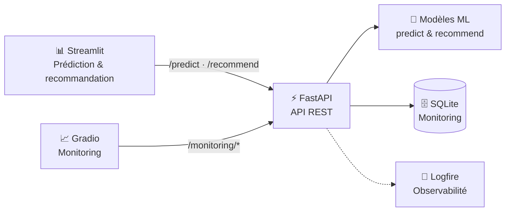
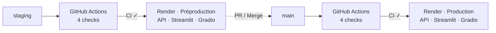

# Projet 12 : Concevez un système de recommandations pour une agriculture optimisée par les données

[](https://github.com/justinetct/oc_project12_agritech/actions/workflows/ci.yml)        

Agritech Answers propose deux services d'aide à la décision agricole : estimer le rendement d'une parcelle
(`/predict`) et classer les cultures d'un pays selon leur rendement estimé (`/recommend`). Les modèles sont
servis par une API FastAPI. Une interface Streamlit permet d'utiliser les deux services, et un dashboard Gradio
suit l'activité de l'API (volumes, erreurs, latences). L'application est déployée sur Render, en préproduction et
en production.

[](https://justinetct.github.io/oc_project12_agritech/rapport_technique.html)

## Applications en ligne

| Service | Préproduction — `staging` | Production — `main` |
|---|:---:|:---:|
| **API** | [](https://oc-p12-agritech-api-preprod.onrender.com/docs) | [](https://oc-p12-agritech-api-prod.onrender.com/docs) |
| **Interface** | [](https://oc-p12-agritech-streamlit-preprod.onrender.com) | [](https://oc-p12-agritech-streamlit-prod.onrender.com) |
| **Monitoring** | [](https://oc-p12-agritech-gradio-preprod.onrender.com) | [](https://oc-p12-agritech-gradio-prod.onrender.com) |

Hébergement gratuit Render : après une période sans trafic, les services se mettent en veille et le premier
accès peut prendre environ une minute. Ouvrir d'abord le Swagger réveille l'API ; si Streamlit affiche une erreur
pendant ce réveil, il suffit de recharger la page.

## Sommaire

- [Objectif métier](#objectif-métier)
- [Données](#données)
- [Modèles et résultats](#modèles-et-résultats)
- [Limites principales](#limites-principales)
- [Notebooks](#notebooks)
- [Démarrage rapide](#démarrage-rapide)
- [Architecture](#architecture)
- [Tests et qualité](#tests-et-qualité)
- [Docker](#docker)
- [CI/CD et déploiement](#cicd-et-déploiement)
- [Structure du dépôt](#structure-du-dépôt)
- [Documentation](#documentation)

## Objectif métier

**Predict — estimer un rendement**

- l'utilisateur décrit sa parcelle : pluie, température, fertilisation et irrigation ;
- la culture, le type de sol et la région ne sont pas demandés : l'analyse n'a pas mis en évidence d'effet
  exploitable de ces variables sur le rendement ;
- l'application affiche le rendement estimé en t/ha ;
- si une valeur sort du domaine vu à l'entraînement, l'estimation est affichée avec un avertissement.

<p align="center">
  
</p>

**Recommend — classer les cultures**

- l'utilisateur choisit son pays ;
- la température et les pesticides du pays (moyennes 2011-2013) et sa pluie sont proposés par défaut, et restent
  modifiables ;
- le modèle estime le rendement des 10 cultures, classées du rendement le plus élevé au plus faible ; les cultures
  jamais observées dans le pays sont signalées.

<p align="center">
  
</p>

## Données

Les deux jeux contiennent des informations complémentaires, mais n'ont pas de contexte commun suffisamment fin
pour être reliés ligne à ligne : `/predict` travaille à l'échelle de la parcelle, `/recommend` à l'échelle
pays × culture × année. Chaque service a donc son propre jeu et son propre modèle.

| Jeu de données | Service | Granularité | Après préparation | Particularités |
|---|---|---|---|---|
| **Agriculture CropYield Dataset** | `/predict` | 1 ligne par parcelle | 999 769 lignes | Pluie, température, fertilisation, irrigation et rendement ; pas de pays ni d'année ; région = point cardinal |
| **CropYield Prediction Dataset** | `/recommend` | 1 ligne par pays × culture × année | 16 319 lignes · 115 pays · 10 cultures · 1990-2013 | Conditions nationales : pluie fixe par pays et pesticides en tonnage national |

Le jeu `/predict` contient 1 000 000 lignes brutes ; 231 rendements négatifs sont retirés avant la modélisation.

Les données ne sont pas versionnées. Leur provenance, l'arborescence attendue et les détails du nettoyage sont
dans [`data/README.md`](data/README.md).


## Modèles et résultats

### `/predict` — estimation du rendement

| Élément | Résultat |
|---|---|
| **Découpage** | 80 % entraînement (799 815) · 20 % test (199 954) |
| **Validation** | Validation croisée à 5 folds sur l'entraînement |
| **Référence** | Prédiction de la moyenne : RMSE 1,70 t/ha en validation croisée |
| **Modèle retenu** | `LinearRegression` |
| **Variables** | Pluie · température · fertilisation · irrigation |
| **Test final** | **RMSE 0,4993 · MAE 0,3983 · R² 0,9132** |

Les autres variables disponibles n'améliorent pas les performances. Les modèles non linéaires testés
(arbres, forêts, boosting), même optimisés, ne font pas mieux que la régression linéaire.

#### Modèle servi

Après l’évaluation, le même pipeline est réentraîné sur les 999 769 lignes disponibles. Ce refit (version 1.1.0) est servi par l’API ; les métriques ci-dessus restent celles du modèle évalué sur le jeu de test.

### `/recommend` — classement des cultures

| Élément | Résultat |
|---|---|
| **Découpage** | Validation temporelle 2008-2012 · test final 2013 (695 lignes) |
| **Validation** | Chaque année est prédite à partir des années précédentes uniquement |
| **Référence** | `DummyRegressor` : RMSE 8,50 t/ha en validation 2008-2012 |
| **Modèle retenu** | `ExtraTreesRegressor` · 150 arbres |
| **Variables** | Culture · année · historiques température/pesticides · pluie · géographie |
| **Test final** | **RMSE 1,6584 · MAE 0,7615 · R² 0,9638** |

Les variables utilisées sont `crop`, `year`, les historiques sur 3 ans de température et de pesticides,
la pluie fixe du pays et sa position géographique (`lat_abs`, `geo_x`, `geo_y`, `geo_z`). Le code pays `iso3`
n'est pas utilisé comme variable.

La modélisation améliore progressivement la RMSE de validation 2008-2012, mesurée sur les mêmes lignes de validation
(le test final 2013 est à part) :

| Modèle | RMSE (t/ha) |
|---|---:|
| `DummyRegressor` | 8,50 |
| `LinearRegression` | 5,51 |
| Régression linéaire + feature engineering | 4,67 |
| **ExtraTreesRegressor final** | **1,43** |


La validation temporelle du modèle final atteint **RMSE 1,4349 t/ha, MAE 0,7114 t/ha et R² 0,971**
sur 2008-2012.

#### Modèle servi

Après l'évaluation, le même modèle et les mêmes réglages sont réentraînés sur toutes les données disponibles
avec historique (**1991-2013 · 15 636 lignes**). Ce refit n'est pas réévalué : les métriques ci-dessus restent
celles du modèle évalué.

L'artefact `models/recommend_model.joblib` (version 2.0.0, ≈ 46,9 Mo) est utilisé pour les recommandations
sur l'année cible technique **2014**, première année après les données disponibles.

## Limites principales

- **Jeux difficiles à relier** : pas de contexte commun suffisamment fin pour fusionner les données ligne à ligne.
- **`/predict`** : l'analyse n'a pas mis en évidence d'effet exploitable de la culture, du type de sol ou de la
  région ; le modèle final repose donc sur quatre variables seulement.
- **`/recommend`** : les conditions sont nationales : aucune information régionale, pluie fixe par pays et
  pesticides exprimés en tonnage national. Cette granularité ne permet pas de représenter les différences
  régionales, notamment dans les grands pays. Les données s'arrêtent en 2013.
- **Validation** : le test final 2013 ne contient que des couples pays × culture déjà observés : les
  recommandations de cultures jamais observées dans un pays restent donc peu évaluées.

Les autres limites et précautions sont détaillées dans
l'[annexe B du rapport](docs/rapport_technique.md#b-limites-et-précautions).

## Notebooks

Les expériences sont suivies dans MLflow (`oc_p12_agritech_predict` et `oc_p12_agritech_recommend`), sur le
serveur défini par `MLFLOW_TRACKING_URI`, sinon dans un dossier local `mlruns/` non versionné. Les fichiers de
données générés ne sont pas versionnés et se reconstruisent avec les notebooks.

**Exploration et préparation**

- `01_eda_agriculture_crop_yield.ipynb` — exploration du dataset parcelle.
- `02_pca_agriculture_crop_yield.ipynb` — ACP exploratoire du dataset parcelle.
- `03_eda_crop_yield_prediction.ipynb` — exploration des sources historiques.
- `04_build_crop_yield_dataset.ipynb` — assemblage et nettoyage du dataset historique.
- `05_dataset_comparison.ipynb` — comparaison des deux datasets et choix d'un dataset par service.
- `06_prepare_training_dataset.ipynb` — datasets d'entraînement de `/predict` et `/recommend`.

**Modèle `/predict`**

- `07_predict_training_baseline.ipynb` — baseline et comparaison avec une régression linéaire.
- `08_predict_feature_engineering.ipynb` — sélection des variables et feature engineering.
- `09_predict_nonlinear_models.ipynb` — comparaison avec des modèles non linéaires.
- `10_predict_model_tuning.ipynb` — tuning des meilleurs modèles et choix final.
- `11_predict_final_evaluation.ipynb` — évaluation finale sur le jeu de test.

**Modèle `/recommend`**

- `12_recommend_training_baseline.ipynb` — validation temporelle, baseline et régression linéaire.
- `13_recommend_feature_engineering.ipynb` — feature engineering avec la régression linéaire.
- `14_recommend_nonlinear_models.ipynb` — modèles non linéaires, tuning et choix de trois finalistes.
- `15_recommend_final_model.ipynb` — choix du modèle, évaluation finale sur 2013 et sauvegarde.
- `16_recommend_final_refit.ipynb` — refit sur 1991-2013 et artefacts servis par l'API (sans évaluation).

### Reconstruire les modèles servis

```bash
make rebuild-models
```

Cette commande reconstruit dans `models/` les 5 fichiers chargés par l'API, à partir des seules données brutes et
du GeoJSON de `data/geo/`, sans `data/processed/` (voir [`data/README.md`](data/README.md)). Fonctionnement,
contrôles de reproductibilité et reconstruction de contrôle : [`scripts/README.md`](scripts/README.md).

Le modèle `/recommend` est sérialisé par `dump_without_tree_state_memo` (`src/agritech/serialization.py`) : même
fichier lzma, relu par `joblib.load`, avec un pic mémoire plus faible au chargement, pour tenir dans les 512 Mo de
l'offre gratuite de Render.

## Démarrage rapide

Prérequis : Python 3.12 et [Poetry](https://python-poetry.org/) 2.x.

```bash
poetry install
cp .env.example .env   # facultatif : MLflow, Logfire, monitoring
```

Les modèles finaux sont versionnés dans `models/` : l'API et l'interface se lancent sans relancer les notebooks.

```bash
make api         # terminal 1 : API sur http://127.0.0.1:8000 (Swagger sur /docs)
make streamlit   # terminal 2 : interface sur http://localhost:8501 (port par défaut de Streamlit)
make gradio      # terminal 3 : dashboard de monitoring sur http://127.0.0.1:7860 (port par défaut de Gradio)
```

Les deux interfaces appellent l'API à l'adresse donnée par `AGRITECH_API_URL`, par défaut
`http://localhost:8000`.

Le dashboard Gradio lit les endpoints de monitoring, protégés par un token : `MONITORING_API_TOKEN` doit avoir
la même valeur côté API et côté dashboard (par exemple dans `.env`, lu par les deux au lancement). Sans token,
le dashboard démarre et indique que le monitoring n'est pas configuré.

Avec l'API lancée, `make health`, `make predict` et `make recommend` envoient des requêtes d'exemple.

**Alternative Docker — lancer toute l'application en une commande**

```bash
make docker-demo
```

Détails dans la section [Docker](#docker).

## Architecture



**Streamlit** et **Gradio** communiquent avec les modèles et le monitoring uniquement via l'API **FastAPI**. Streamlit fournit les interfaces de prédiction et de recommandation, tandis que Gradio présente le suivi de l'activité de l'API.

L'API expose les services `/predict` et `/recommend`, leurs contextes associés, ainsi que des endpoints de monitoring protégés par token.

Le monitoring combine **SQLite** pour l'historique des appels `POST /predict` et `POST /recommend`, **Gradio** pour la visualisation des indicateurs et **Logfire** pour l'observabilité de l'API (ces deux appels et `GET /health`). Le dashboard Gradio déployé est public ; seuls les endpoints `/monitoring/*` de l'API demandent un token. En préproduction et en production, les environnements et leurs données d'observabilité sont séparés.

## Tests et qualité

```bash
make lint             # contrôle Ruff (règles par défaut, notebooks exclus)
make test             # suite complète avec couverture
make test-api         # tests d'un service, sans couverture, comme dans la CI
make test-streamlit
make test-gradio
```

La suite complète compte **801 tests**. Couverture : **97 %** sur le périmètre mesuré : les modules servis
(`agritech.api`, `agritech.serving`, `agritech.monitoring`, `agritech.observability` et `agritech.ui`) et la
sérialisation des modèles (`agritech.serialization`). Les points d'entrée `streamlit_app/` et `gradio_app/app.py` sont testés mais
hors de ce calcul. Les modules d'entraînement, utilisés par les notebooks, en sont aussi exclus ; leurs invariants
critiques (historique sans fuite temporelle, découpage temporel) sont testés à part.

## Docker

La démo complète (API, Streamlit et Gradio) se lance localement avec Docker Compose :

```bash
make docker-demo   # construit et démarre les 3 services
make docker-down   # arrête les conteneurs
```

Un seul `Dockerfile` contient une cible par service. Streamlit et Gradio communiquent avec FastAPI par le réseau Docker. Les secrets sont fournis par l'environnement et ne sont pas versionnés.

Les images Docker des trois services sont construites et vérifiées par la CI ; Render les reconstruit ensuite pour le déploiement.

## CI/CD et déploiement



La CI se lance à chaque push ou pull request vers `staging` ou `main`, ou à la main (`workflow_dispatch`) : qualité, tests, construction des images Docker et healthchecks. GitHub Actions ne déploie rien : **Render attend que tous les checks du commit soient verts**, puis reconstruit ses propres images et redéploie l'environnement de la branche.

`staging` alimente la **préproduction** et `main` la **production**. Le passage de `staging` à `main` reste manuel.

Les deux environnements disposent de leur propre configuration et de leurs propres secrets, générés ou saisis dans Render et jamais versionnés dans Git.

## Structure du dépôt

```
.
├── .github/workflows/ci.yml         # CI : qualité, tests et images Docker
├── .streamlit/config.toml           # thème de l'interface
├── data/                            # données locales, non versionnées (voir data/README.md)
├── docs/                            # rapport (Markdown, HTML publié, figures)
├── gradio_app/app.py                # dashboard de monitoring (Gradio)
├── models/                          # modèles servis et leurs métadonnées
├── notebooks/                       # exploration, préparation et modélisation
├── scripts/                         # préparation des données et reconstruction des modèles servis
├── src/agritech/                    # code partagé : prétraitement, modélisation, serving
│   ├── api/                         # FastAPI : routers, schémas, middleware
│   ├── monitoring/                  # archivage SQLite, lectures du monitoring, rejeu, historique de démo
│   ├── observability/               # configuration Logfire facultative
│   └── ui/                          # client HTTP et composants des interfaces
├── streamlit_app/
│   ├── app.py                       # point d'entrée Streamlit
│   └── views/                       # pages Predict et Recommend
├── tests/                           # tests pytest
├── Dockerfile                       # une image par service : api, streamlit, gradio
├── docker-compose.yml               # démo locale des trois services
├── Makefile
├── pyproject.toml
├── render.preprod.yaml              # Blueprint Render de la préproduction (staging)
├── render.prod.yaml                 # Blueprint Render de la production (main)
├── requirements.txt                 # dépendances de l'image API
├── requirements-streamlit.txt       # dépendances de l'image Streamlit
└── requirements-gradio.txt          # dépendances de l'image Gradio
```

## Documentation

- Rapport technique : [`docs/rapport_technique.md`](docs/rapport_technique.md), publié en HTML sur
  [GitHub Pages](https://justinetct.github.io/oc_project12_agritech/rapport_technique.html). Version PDF :
  [`docs/rapport_technique.pdf`](docs/rapport_technique.pdf).
- Données : [`data/README.md`](data/README.md).
- API : documentation Swagger sur `/docs`, en ligne (voir [Applications en ligne](#applications-en-ligne)) ou en
  local sur `http://127.0.0.1:8000/docs`.
- CI : [historique des runs GitHub Actions](https://github.com/justinetct/oc_project12_agritech/actions/workflows/ci.yml).
