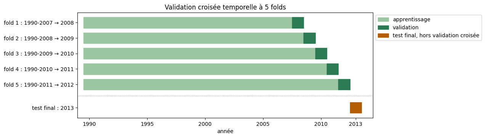
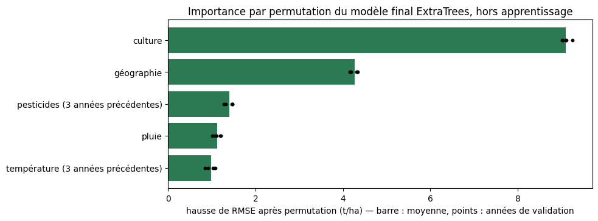
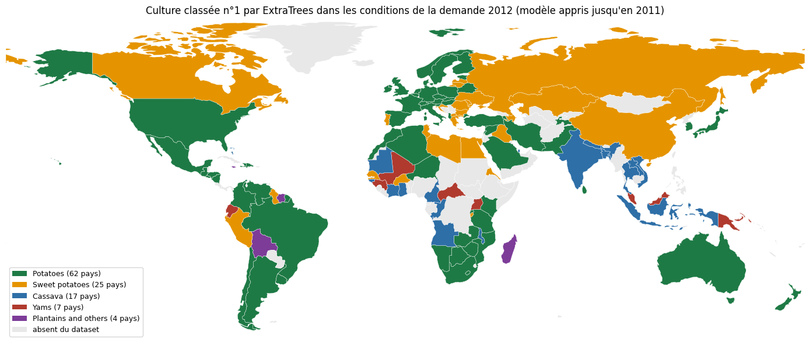
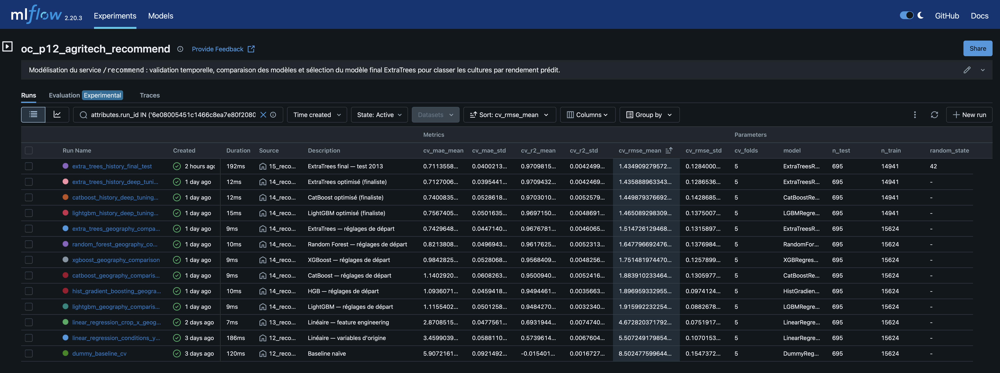

# Rapport — Agritech Answers

*Système de prédiction de rendement et de recommandation de cultures.*

## Sommaire

1. [Contexte et données](#1-contexte-et-données)
2. [Exploration et stratégie](#2-exploration-et-stratégie)
3. [`/predict` — estimation du rendement](#3-predict--estimation-du-rendement)
4. [`/recommend` — recommandation de cultures](#4-recommend--recommandation-de-cultures)
5. [De l'analyse à l'API](#5-de-lanalyse-à-lapi)

[Annexes](#annexes)

- [A. Limites et précautions](#a-limites-et-précautions)
- [B. Glossaire](#b-glossaire)
- [C. Tuning `/predict`](#c-tuning-predict)
- [D. Tuning `/recommend`](#d-tuning-recommend)

## 1. Contexte et données

Agritech Answers veut proposer aux agriculteurs une application web qui répond à deux questions :

- **`/predict`** : l'agriculteur a déjà choisi sa culture et veut connaître le rendement attendu de sa parcelle ;
- **`/recommend`** : il cherche quelle culture choisir dans son pays ; le service estime le rendement des 10 cultures
  à partir de l'historique du pays, puis les classe.

| | **Agriculture CropYield** | **CropYield Prediction** |
|---|---|---|
| Une ligne | une parcelle sur une saison | un pays, une année, une culture |
| Volume brut | 1 000 000 lignes × 10 colonnes | 4 fichiers sources + un fichier déjà assemblé |
| Période | pas d'année | 1990‑2013 |
| Géographie | 4 zones sans lieu réel (North, East, South, West) | 168 pays après jointure, 115 après nettoyage |
| Cultures | 6 | 10 |
| Variables principales | pluie, température, sol, engrais, irrigation | rendement, température, pluie, pesticides |
| Cible | `Yield_tons_per_hectare` (t/ha) | `yield_t_ha` (t/ha, converti depuis hg/ha) |
| Service | **`/predict`** | **`/recommend`** |

Les six cultures du jeu parcellaire ont presque le même rendement : il ne permet pas de classer des cultures. Le
jeu historique les distingue bien, mais ne décrit aucune parcelle. **Chaque service a donc son propre dataset et son
propre modèle**, et les lignes des deux jeux ne sont jamais mélangées.

| Information | Saisie dans l'application | Utilisée par le modèle `/predict` |
|---|---|---|
| Pluie de la saison (`Rainfall_mm`) | oui | **oui** |
| Température moyenne (`Temperature_Celsius`) | oui | **oui** |
| Engrais, oui ou non (`Fertilizer_Used`) | oui | **oui** |
| Irrigation, oui ou non (`Irrigation_Used`) | oui | **oui** |
| Culture | oui | non |
| Type de sol | oui | non |

### Préparation des données

- **Agriculture CropYield** : un million de lignes sans valeur manquante ni doublon, aux distributions uniformes et
  aux catégories équilibrées : tout indique un jeu simulé. Les 231 rendements négatifs, impossibles, sont retirés :
  il reste 999 769 lignes pour `/predict`.
- **CropYield Prediction** : le fichier déjà assemblé, `yield_df.csv`, n'est pas utilisé. Il duplique des lignes
  (jusqu'à 52 relevés de température par pays et par année dans `temp.csv`) et perd des pays dont le nom diffère d'un fichier à
  l'autre. L'assemblage est refait à partir des quatre sources, sur le code ISO3 des pays : 22 679 lignes et
  168 pays sur 1990-2013.

Trois règles donnent le dataset historique nettoyé, sans inventer de valeurs :

| Règle | Traitement | Lignes | Pays |
|---|---|---:|---:|
| Pluie absente certaines années | la valeur connue du pays est reprise (947 lignes de 2003, 6 des Bahamas en 1990‑1991) | 953 complétées | — |
| Pays sans température ou sans pesticides | pays retirés plutôt que complétés avec les valeurs d'un voisin | −6 322 | −51 |
| Pluie erronée | Monténégro et Soudan, dont la pluie est recopiée d'un pays voisin dans l'ordre alphabétique, retirés | −38 | −2 |

**Dataset historique nettoyé : 16 319 lignes, 115 pays, 10 cultures, 1990-2013, aucune valeur manquante**
(`data/processed/crop_yield_clean.csv`). C'est le dataset d'entraînement de `/recommend`.

## 2. Exploration et stratégie

### Jeu parcellaire : quatre variables portent le rendement

| Variable | Corrélation | Relation observée |
|---|---|---|
| `Rainfall_mm` | **0,765** | la plus liée au rendement ; relation linéaire |
| `Fertilizer_Used` | **0,442** | rendement moyen supérieur de **1,50 t/ha** avec engrais |
| `Irrigation_Used` | **0,354** | rendement moyen supérieur de **1,20 t/ha** avec irrigation |
| `Temperature_Celsius` | 0,086 | +0,445 t/ha du plus froid au plus chaud, de façon régulière |
| `Days_to_Harvest` | −0,003 | aucune relation visible (0,029 t/ha d'écart entre tranches) |

- Les courbes de droite sont presque parallèles : l'écart de rendement moyen associé à l'engrais et
  à l'irrigation reste le même quel que soit le niveau de pluie.
- `Region`, `Soil_Type`, `Crop` et `Weather_Condition` sont équilibrées, et le rendement moyen ne diffère que de
  **0,012 t/ha au maximum** entre leurs modalités.

> [!IMPORTANT]
> **`/recommend` ne peut pas s'appuyer sur ce dataset.** Classer six cultures qui ont le même
> rendement donnerait un ordre au hasard. C'est pour cette raison que le second dataset est
> utilisé.

### Analyse en composantes principales

| Axe | F1 | F2 | F3 | F4 | F5 | F6 |
|---|---|---|---|---|---|---|
| Variance expliquée (%) | **32,58** | 16,71 | 16,68 | 16,67 | 16,62 | 0,74 |
| Cumul (%) | 32,58 | 49,29 | 65,97 | 82,64 | 99,26 | 100,00 |

- **Un seul axe se détache** : F1 est l'axe du rendement (corrélation de 0,99), avec la pluie (0,79), l'engrais
  (0,46) et l'irrigation (0,37). Ce sont les variables clés du jeu parcellaire.
- **Aucune réduction de variables possible** : sans le rendement, chaque axe explique environ 20 % de la variance,
  et les cultures ne se séparent pas. L'ACP reste exploratoire.

### Jeu historique : des cultures très différentes

Les niveaux de rendement varient fortement d'une culture à l'autre, sur les 24 années : c'est ce signal, absent du
jeu parcellaire, qui rend `/recommend` possible.

### Stratégie : deux jeux, deux modèles

Sur les quatre cultures communes, l'historique montre des niveaux bien distincts, du soja (médiane 1,58 t/ha) au riz
(3,47 t/ha), alors que le jeu parcellaire donne quatre boîtes presque identiques.

> **Aucune fusion ligne à ligne.** Les deux jeux n'ont ni la même unité d'observation, ni les mêmes
> plages de valeurs, ni la même définition de la pluie. Ils répondent à deux questions différentes,
> avec deux modèles distincts.

## 3. `/predict` — estimation du rendement

La modélisation suit cinq étapes, toutes avec le même protocole :

1. référence et protocole (notebook 07) ;
2. sélection des features et feature engineering (notebook 08) ;
3. modèles non linéaires sur les deux jeux de variables, puis vérification du feature engineering
   (notebook 09) ;
4. tuning (notebook 10) ;
5. évaluation finale sur le jeu de test et sauvegarde du modèle (notebook 11).

### Protocole

- **Découpage.** Les 999 769 lignes, après le retrait des 231 rendements négatifs, sont découpées une
  fois pour toutes en 80 % d'entraînement (799 815 lignes) et 20 % de test (199 954 lignes), avec
  `random_state=42`. Le tirage est aléatoire : le dataset n'a ni date ni année.
- **Rôle du test.** **Le jeu de test n'a servi à aucun choix de modèle, de variable ou
  d'hyperparamètre** : il sert uniquement à l'évaluation finale du modèle retenu.
- **Comparaisons.** Validation croisée `KFold(n_splits=5, shuffle=True, random_state=42)` sur le jeu
  d'entraînement : 639 852 lignes d'apprentissage et 159 963 d'évaluation par fold, mêmes folds pour
  tous les modèles. Le score est la moyenne des 5 folds.
- **Métriques.** RMSE (t/ha, pénalise les grosses erreurs) et R² (part de la variance expliquée) sont
  les métriques principales ; la MAE (t/ha) les complète.
- **Pipeline.** Variables catégorielles encodées par <code class="cat">OneHotEncoder(handle_unknown="ignore")</code>,
  variables numériques inchangées, puis le modèle. L'encodage est réappris dans chaque fold : pas de
  fuite de données.

### Jeux de variables testés

| Jeu | Features | One‑hot | Numériques | Total colonnes |
|---|---|---:|---:|---:|
| toutes les variables | <code class="cat">Crop</code>, <code class="cat">Soil_Type</code>, <code class="cat">Region</code>, <code class="cat">Weather_Condition</code>, <code class="cat">Fertilizer_Used</code>, <code class="cat">Irrigation_Used</code>, `Rainfall_mm`, `Temperature_Celsius`, `Days_to_Harvest` | 23 | 3 | **26** |
| variables réduites | <code class="cat">Crop</code>, <code class="cat">Soil_Type</code>, <code class="cat">Fertilizer_Used</code>, <code class="cat">Irrigation_Used</code>, `Rainfall_mm`, `Temperature_Celsius` | 16 | 2 | **18** |
| variables sélectionnées | <code class="cat">Fertilizer_Used</code>, <code class="cat">Irrigation_Used</code>, `Rainfall_mm`, `Temperature_Celsius` | 4 | 2 | **6** |
| variables sélectionnées + <code class="cat">Crop</code> | les 4 variables sélectionnées et <code class="cat">Crop</code> | 10 | 2 | **12** |
| toutes les variables + feature engineering | toutes les variables et des interactions numériques | 23 | 6 ou 15 | **29 ou 38** |

<code class="cat">catégorielle</code> : encodée par one-hot, une colonne par modalité, variables oui/non comprises ;
`numérique` : gardée telle quelle.

Les variables réduites retirent `Region`, `Weather_Condition` et `Days_to_Harvest` ; les variables
sélectionnées sont les 4 qui portent le signal.

### Référence et sélection des variables

| Modèle | Features | RMSE CV (t/ha) | MAE CV (t/ha) | R² CV |
|---|---|---:|---:|---:|
| **`LinearRegression`** | **variables sélectionnées** | **0,500332** | **0,399292** | **0,91289** |
| `LinearRegression` | variables sélectionnées + <code class="cat">Crop</code> | 0,500333 | 0,399293 | 0,91289 |
| `LinearRegression` | variables réduites | 0,500334 | 0,399293 | 0,91289 |
| `LinearRegression` | toutes les variables | 0,500337 | 0,399294 | 0,91289 |
| `LinearRegression` | toutes les variables + interactions pluie, engrais, irrigation | 0,500338 | 0,399296 | 0,91289 |
| `LinearRegression` | toutes les variables + effets selon la culture | 0,500341 | 0,399297 | 0,91289 |
| `DummyRegressor` | aucune : rendement moyen | 1,695214 | 1,388358 | ≈ 0 |

L'écart-type entre folds est d'environ 0,0009 t/ha sur la RMSE des régressions.

- Le `DummyRegressor` a une RMSE proche de l'écart-type du rendement (1,695 t/ha) ; la régression
  linéaire la réduit d'environ 70 %.
- Toutes les régressions tiennent dans 0,00001 t/ha, bien moins que la variation d'un fold à
  l'autre : ni les variables supplémentaires ni le feature engineering n'apportent de gain.
- **Features retenues : les 4 variables sélectionnées**, qui portent le signal.

Ces scores décrivent une performance prédictive, pas un lien de cause à effet.

### Feature engineering : des relations plus complexes aident-elles ?

L'exploration montre des relations simples et presque linéaires. Avant de garder un modèle aussi simple, on a
vérifié si des relations plus complexes apportaient une information en plus. Chaque test est comparé à la
régression sur toutes les variables (RMSE 0,500337 t/ha).

| Question | Test | Résultat | Décision |
|---|---|---|---|
| L'effet de la pluie dépend-il de l'engrais ou de l'irrigation ? | 3 colonnes croisées « eau × intrants » : pluie × engrais, pluie × irrigation, engrais × irrigation | RMSE 0,500338 ; ces colonnes ne pèsent presque rien dans les prédictions | non retenues |
| La pluie et la température jouent-elles différemment selon la culture ? | une pente de pluie et une pente de température par culture (12 colonnes) | RMSE 0,500341 ; les nouvelles colonnes se partagent l'information de la pluie sans en ajouter | non retenues |
| La culture aide-t-elle à prédire ? | modèle avec et sans `Crop` ; même parcelle rejouée avec les 6 cultures | +0,000002 t/ha ; la prédiction ne change que de 0,003 t/ha d'une culture à l'autre, pour une erreur de 0,50 t/ha | `Crop` hors du modèle |
| Un modèle plus souple en tire-t-il parti ? | les deux familles d'interactions ajoutées à 5 modèles d'ensemble (notebook 09) | écarts de 0,00014 t/ha au plus, souvent une légère dégradation | pas de gain |

Ces relations n'ont pas apporté de gain prédictif mesurable avec nos données et notre protocole. Cela ne veut pas
dire qu'elles n'existent pas en agronomie : ce jeu de données ne permet pas de les mettre en évidence. `Crop` reste
une information de l'application, pas une variable du modèle.

### Modèles non linéaires

Six modèles sont comparés sur les deux jeux de variables, sans optimisation : l'arbre et la forêt
avec `min_samples_leaf=100`, les boostings avec les réglages par défaut de leur librairie (sans arrêt anticipé pour
HistGradientBoosting). La régression linéaire sert de référence.

| Modèle | Toutes les variables — RMSE (MAE / R²) | Variables réduites — RMSE (MAE / R²) |
|---|---:|---:|
| **`LinearRegression`** | **0,500337** (0,3993 / 0,9129) | **0,500334** (0,3993 / 0,9129) |
| `HistGradientBoosting` | 0,500886 (0,3997 / 0,9127) | 0,500881 (0,3997 / 0,9127) |
| `LightGBM` | 0,500924 (0,3998 / 0,9127) | 0,500922 (0,3998 / 0,9127) |
| `CatBoost` | 0,501029 (0,3999 / 0,9126) | 0,500935 (0,3998 / 0,9127) |
| `RandomForest` | 0,502018 (0,4007 / 0,9123) | 0,502129 (0,4008 / 0,9123) |
| `XGBoost` | 0,502183 (0,4008 / 0,9122) | 0,502008 (0,4006 / 0,9123) |
| `DecisionTree` | 0,508558 (0,4059 / 0,9100) | 0,507489 (0,4051 / 0,9104) |

- Aucun ne fait mieux que la régression linéaire, qui reste devant sur chacun des 5 folds. Les
  meilleurs boostings (HistGradientBoosting, LightGBM, CatBoost) sont à moins d'un millième de t/ha,
  pour un entraînement plus long.
- Les variables réduites font aussi bien que toutes les variables : écart négligeable pour la
  régression linéaire, HistGradientBoosting et LightGBM, léger gain pour l'arbre, XGBoost et
  CatBoost. Seule la forêt fait un peu mieux avec toutes les variables, d'un écart huit fois plus
  petit que l'écart-type entre folds.
- Permutation, corrélation de Spearman et SHAP donnent la même hiérarchie : la pluie, puis l'engrais
  et l'irrigation, puis la température ; les autres variables n'apportent rien.

Ce résultat est cohérent avec l'EDA : les principales relations avec le rendement sont presque
linéaires et les interactions testées n'apportent pas de gain. Les modèles plus complexes ont donc
peu de structure supplémentaire à apprendre.

### Tuning

Sur les 4 variables sélectionnées et les mêmes folds : tuning léger de 5 familles (10 configurations chacune), puis
tuning approfondi des deux modèles retenus pour l'approfondissement, CatBoost et HistGradientBoosting
(35 configurations chacune). Les grilles testées sont détaillées en
[annexe C](#c-tuning-predict).

| Modèle, variables sélectionnées | RMSE CV (t/ha) | MAE CV (t/ha) | R² CV | Folds gagnés face à la régression linéaire |
|---|---:|---:|---:|---:|
| **`LinearRegression`** | **0,500332** | **0,399292** | **0,91289** | — |
| `CatBoost` optimisé | 0,500411 | 0,399369 | 0,91286 | 0 sur 5 |
| `HistGradientBoosting` optimisé | 0,500640 | 0,399543 | 0,91278 | 0 sur 5 |

- Le tuning améliore légèrement les deux modèles, sans dépasser la régression linéaire, ni en
  moyenne ni sur un seul fold.
- Entraînement par fold : 16 s pour CatBoost et 29 s pour HistGradientBoosting, contre 0,1 s pour la
  régression linéaire.

### Modèle final

**`LinearRegression` avec les 4 variables sélectionnées** : meilleure RMSE en validation croisée, entraînement quasi
instantané, coefficients directement lisibles. Ce choix repose uniquement sur la validation croisée.

### Évaluation finale sur le jeu de test

Le notebook 11 vérifie que le pipeline redonne les scores de validation croisée, l'entraîne sur tout
le jeu d'entraînement, puis l'évalue sur le jeu de test. La ligne « Train » mesure ce modèle final
sur les données qui ont servi à l'entraîner.

| Jeu | RMSE (t/ha) | MAE (t/ha) | R² |
|---|---:|---:|---:|
| Train | 0,500330 | 0,399291 | 0,91289 |
| Validation croisée | 0,500332 | 0,399292 | 0,91289 |
| **Test** | **0,499268** | **0,398338** | **0,91323** |

- Les scores du train et de la validation croisée sont quasi identiques : aucun signe de surapprentissage n'apparaît.
- Les scores du test sont très proches, et même légèrement meilleurs : les écarts restent de l'ordre
  de la variation entre folds.
- Le résidu moyen est presque nul (+0,0001 t/ha). 68,3 % des prédictions sont à moins de 0,5 t/ha de
  la valeur réelle, et 95,5 % à moins de 1 t/ha.
- Par tranches de 0,5 t/ha de rendement réel, l'erreur absolue moyenne reste autour de 0,4 t/ha
  entre 1 et 8,5 t/ha, où se trouvent 98,4 % des lignes du test. Elle augmente aux deux extrémités,
  peu peuplées.
- **Les 231 rendements négatifs**, retirés avant le découpage, ont des cibles de −1,15 t/ha à
  presque 0. Le modèle final leur prédit des rendements faibles mais positifs, de 0,817 à
  1,815 t/ha. Ce résultat est cohérent avec l'hypothèse d'anomalies dans les données, sans la
  démontrer.

### Sauvegarde et suivi MLflow

- **Modèle sauvegardé.** Le pipeline complet, entraîné sur le seul jeu d'entraînement, est dans
  `models/predict_model.joblib`. Ses métadonnées sont dans `models/predict_model_metadata.json` :
  variables et valeurs attendues, preprocessing, protocole, scores sur le test, versions. Rechargé,
  il redonne les mêmes prédictions sur 1 000 lignes du test.
- **Suivi.** Les 150 évaluations sont dans une expérience MLflow dédiée à `/predict`, un run par
  évaluation, avec le protocole, le jeu de variables et les mêmes métriques `cv_`. Le run d'évaluation finale, à
  l'étape `final_evaluation`, ajoute `test_rmse`, `test_mae` et `test_r2`. La capture montre les 11 runs de
  synthèse : triés par `cv_rmse_mean`, ils donnent directement le classement des modèles.

## 4. `/recommend` — recommandation de cultures

La modélisation suit la même progression que pour `/predict` (notebooks 12 à 15). Le modèle prédit un rendement par
culture, puis le service trie les 10 cultures : c'est une régression, pas une classification.

### Protocole

Pour un pays et une culture, le rendement change peu d'une année à l'autre (corrélation de 0,985 avec l'année
précédente) : un découpage aléatoire placerait des lignes presque identiques dans l'apprentissage et dans
l'évaluation. Le découpage suit donc le temps.

2013 est gardée de côté pour le test final. Pour comparer les modèles, on utilise les 5 années précédentes, de
2008 à 2012 : chaque année est prédite uniquement à partir des années qui la précèdent.

**2013 n'a servi à aucun choix de modèle, de variable ou d'hyperparamètre.**

### Feature engineering : les variables construites

Le jeu historique ne donne que la culture, la température, la pluie et les pesticides de l'année. Les variables
suivantes sont construites à partir de ces données, toujours avec les seules années passées.

| Variable construite | Calcul | Pourquoi |
|---|---|---|
| `log_pesticides` | logarithme du tonnage de pesticides | le tonnage va de moins d'une tonne à plus d'un million : en brut, presque toutes les lignes sont tassées au bas de l'échelle |
| `lat_abs` | latitude du pays, sans son signe | distance à l'équateur : distingue pays tempérés et tropicaux |
| `geo_x`, `geo_y`, `geo_z` | latitude et longitude du pays, combinées en une position sur un globe | la longitude n'a pas d'équivalent de l'équateur, donc pas de `long_abs` : elle sert seulement à situer le pays, avec la latitude ; deux pays voisins restent proches, y compris de part et d'autre de ±180° |
| `temp_hist`, `log_pest_hist` | moyenne des 3 années précédentes de la température et des pesticides | les conditions de l'année à venir ne sont pas connues au moment de recommander |

- La position décrit la géographie du pays sans lui donner d'identifiant. Mais chaque pays ayant une position unique,
  un arbre peut aussi s'en servir pour reconnaître le pays (annexe A.2).

- Le notebook 13 teste aussi des **interactions culture × variable** : une colonne par culture et par variable, qui
  ne vaut la variable que pour les lignes de cette culture (0 sinon), pour que chaque culture ait son propre effet
  plutôt qu'un effet commun. Exemple : `Maize x avg_temp` reprend la température des lignes de maïs, 0 ailleurs.

### Jeux de variables testés

| Jeu | Features | One‑hot / catégorielles | Numériques | Total colonnes |
|---|---|---:|---:|---:|
| 1. Variables d'origine | <code class="cat">crop</code>, `year`, `avg_temp`, `rain_mm`, `pesticides_t` | 10 | 4 | **14** |
| 2. Pesticides en log | <code class="cat">crop</code>, `year`, `avg_temp`, `rain_mm`, `log_pesticides` | 10 | 4 | **14** |
| 3. + interactions culture × conditions | <code class="cat">crop</code>, `year`, `avg_temp`, `rain_mm`, `log_pesticides`, <code class="interact">interactions</code> | 10 | 4 | **44** |
| 4. + position du pays | <code class="cat">crop</code>, `year`, `avg_temp`, `rain_mm`, `log_pesticides`, `lat_abs`, `geo_x`, `geo_y`, `geo_z`, <code class="interact">interactions</code> | 10 | 8 | **48** |
| 5. + interactions culture × géographie (`crop_x_geography`) | <code class="cat">crop</code>, `year`, `avg_temp`, `rain_mm`, `log_pesticides`, `lat_abs`, `geo_x`, `geo_y`, `geo_z`, <code class="interact">interactions</code> | 10 | 8 | **88** |
| 6. Conditions historiques | <code class="cat">crop</code>, `year`, `temp_hist`, `rain_mm`, `log_pest_hist`, `lat_abs`, `geo_x`, `geo_y`, `geo_z`, <code class="interact">interactions</code> | 10 | 8 | 88 (régression) / **18** (arbres) |

La température et les pesticides de l'année sont remplacés par leur moyenne sur les 3 années précédentes
(`temp_hist`, `log_pest_hist`), connues au moment de recommander. La pluie reste celle du pays, fixe dans ce
dataset. `crop` est encodée par one-hot, une colonne par culture (10 modalités) ; les autres variables sont
numériques, gardées telles quelles.

<code class="interact">interactions</code> ajoute une colonne par culture et par variable (0 pour les lignes des
autres cultures) : chaque culture peut avoir sa propre pente pour cette variable. Exemples :

- ligne 3 : `crop × {avg_temp, rain_mm, log_pesticides}` — une colonne `Maize x avg_temp`, une `Maize x rain_mm`, etc. pour chacune des 10 cultures (30 colonnes) ;
- ligne 5 : `crop × {avg_temp, rain_mm, log_pesticides, lat_abs, geo_x, geo_y, geo_z}` — le même principe, étendu à la géographie (70 colonnes).

Ces interactions ne servent qu'à la régression linéaire : les modèles à arbres de la section suivante peuvent apprendre
nativement un effet différent selon la culture, sans en avoir besoin. La ligne 6 les garde donc pour la régression
(88 colonnes) mais les retire pour les arbres (18 colonnes, section suivante).

### Référence et sélection des variables

| Étape | RMSE (t/ha) | MAE (t/ha) | R² | Ce qu'on apprend |
|---|---:|---:|---:|---|
| Référence naïve | 8,503 | 5,907 | −0,015 | prédire le rendement moyen ne suffit pas |
| Variables d'origine | 5,507 | 3,460 | 0,574 | les variables disponibles apportent déjà beaucoup d'information |
| Pesticides en log | 5,346 | 3,368 | 0,598 | le logarithme améliore la régression et est conservé |
| + interactions culture × conditions | 4,995 | 3,081 | 0,649 | chaque culture peut avoir sa propre pente de température, de pluie et de pesticides |
| + position du pays | 4,851 | 3,025 | 0,669 | la position seule, sans lui donner d'interaction, améliore encore, en gardant les interactions culture × conditions de la ligne précédente |
| **+ interactions culture × géographie** | **4,673** | **2,871** | **0,693** | **meilleure régression linéaire du notebook 13 (`crop_x_geography`)** |

Sur les lignes qui ont un historique, cette régression obtient un RMSE de 4,664 (pas 4,673 : le nombre de lignes
diffère). Remplacer la température et les pesticides de l'année par leur moyenne des 3 années précédentes fait
passer ce RMSE à 4,644 — les seules conditions connues au moment de recommander.

**Référence linéaire retenue : interactions culture × géographie, RMSE 4,673 t/ha** — meilleure régression sans
identifiant de pays, reprise comme référence au notebook 14.

### Modèles non linéaires

On teste d'abord les modèles à arbres avec les variables de base, sans interaction, pour voir l'impact du non
linéaire seul.

Réglages de départ (annexe D.1), validation temporelle :

| Modèle | Pesticides en log — RMSE (MAE / R²) | Position du pays — RMSE (MAE / R²) | Repr. finale — RMSE |
|---|---:|---:|---:|
| **`ExtraTrees`** | **1,706** (0,846 / 0,959) | **1,515** (0,743 / 0,968) | **1,442** |
| `RandomForest` | 2,098 (1,002 / 0,938) | 1,648 (0,821 / 0,962) | 1,609 |
| `XGBoost` | 2,119 (1,193 / 0,937) | 1,751 (0,984 / 0,957) | 1,693 |
| `HistGradientBoosting` | 2,286 (1,306 / 0,926) | 1,897 (1,094 / 0,949) | 1,844 |
| `LightGBM` | 2,270 (1,320 / 0,928) | 1,916 (1,116 / 0,948) | 1,843 |
| `CatBoost` | 2,306 (1,430 / 0,925) | 1,884 (1,140 / 0,950) | 1,851 |

Le notebook 14 teste quand même les interactions culture × géographie sur les six familles : elles dégradent les
forêts (`RandomForest`, `ExtraTrees`) et `XGBoost`, et n'améliorent que légèrement `HistGradientBoosting`,
`LightGBM` et `CatBoost`. La suite garde donc « position du pays » sans interactions, plus simple et aussi bonne.

La **représentation finale** reprend « position du pays », en remplaçant la température et les pesticides par leur
moyenne des 3 années précédentes (`temp_hist`, `log_pest_hist`), connues au moment de recommander.

- Contrairement à `/predict`, la régression linéaire ne suffit pas : les arbres font deux à trois fois moins d'erreur,
  même sans la position du pays.
- La position du pays aide les arbres. La représentation finale les améliore encore de 0,05 à 0,09 t/ha, à lignes
  égales (lignes qui ont un historique).

### Tuning

Un tuning léger teste 6 familles de modèles, puis un tuning plus fin approfondit les 3 meilleures.

| Étape | Résultat (RMSE, MAE, R² de validation) |
|---|---|
| 1. Tuning léger | meilleur — **ExtraTrees**, réglage de départ : 1,442 (MAE 0,710, R² 0,971) moins bon — RandomForest : 1,570 (MAE 0,791, R² 0,965) |
| 2. Trois finalistes | 1. ExtraTrees 1,442 (MAE 0,710, R² 0,971) 2. CatBoost 1,458 (MAE 0,753, R² 0,970) 3. LightGBM 1,483 (MAE 0,779, R² 0,969) |
| 3. Tuning approfondi | 1. **ExtraTrees 1,436** (MAE 0,713, R² 0,971) 2. CatBoost 1,450 (MAE 0,740, R² 0,970) 3. LightGBM 1,465 (MAE 0,757, R² 0,970) |
| 4. Choix, avant 2013 | **ExtraTrees** : meilleures RMSE et MAE, plus stable d'une année à l'autre ; en plus, scikit-learn seul (plus simple à déployer) |
| 5. Allègement | **150 arbres, 60,8 Mo compressés**, même RMSE (1,4349 contre 1,4359) et MAE (0,7114 contre 0,7127) |

- **Pourquoi alléger ExtraTrees ?** Le modèle doit être enregistré dans le dépôt et chargé par l'API. Avec 300 arbres,
  il pèse 425 Mo (121,6 Mo compressés) : au-delà de la limite de 100 Mo par fichier de GitHub, et lent à charger.
- La taille d'une forêt dépend de son nombre de nœuds, donc surtout du nombre d'arbres. Or la RMSE ne baisse plus
  au-delà de 150 arbres : on garde la même performance pour un fichier deux fois plus petit, plus rapide à charger et
  à interroger (annexe D.4).

### Modèle final

**ExtraTrees à 150 arbres** : `max_features=0.9`, `min_samples_split=3`, `random_state=42`, `n_jobs=1`.

- Variables : culture, année, température et pesticides moyens des 3 années précédentes, pluie du pays, position du
  pays (`lat_abs`, `geo_x`, `geo_y`, `geo_z`).
- Les conditions historiques utilisent la moyenne des 3 années précédentes : la première année de chaque pays
  (1990) n'a donc pas d'historique et sort de l'apprentissage, ce qui ramène le développement de 15 624 à 14 941
  lignes (1991-2012).
- Pipeline complet de 60,8 Mo compressés, dans `models/recommend_model.joblib`, avec ses métadonnées.

### Importance des variables

- La culture compte de loin le plus, puis la géographie ; les pesticides, la pluie et la température viennent loin
  derrière. L'ordre est le même les 5 années.
- `year` ne peut pas être mélangée dans une seule année de validation : sans elle, le modèle réappris passe de 1,435
  à 1,830 t/ha de RMSE.
- Ces importances décrivent l'usage des variables par le modèle, pas un effet causal : pluie, température, pesticides
  et géographie sont des valeurs du pays, qui portent en partie le même signal.

### Évaluation finale

| Jeu | RMSE (t/ha) | MAE (t/ha) | R² |
|---|---:|---:|---:|
| Validation temporelle 2008‑2012 | 1,4349 | 0,7114 | 0,9710 |
| **Test final 2013 (695 lignes)** | **1,6584** | **0,7615** | **0,9638** |

- Le test est cohérent avec la validation, dont l'erreur augmentait déjà d'une année à l'autre (environ 1,22 t/ha en
  2008, 1,58 en 2012).
- 2013 n'a servi à aucun choix : le modèle était figé avant l'évaluation finale.
- Limite : toutes les lignes de 2013 portent sur des couples pays × culture déjà observés.

### Ce que recommande le modèle

La carte montre, pour chacun des 115 pays, la culture classée n°1 pour la campagne 2012 par un ExtraTrees appris
jusqu'en 2011.

- Seules cinq cultures arrivent n°1, celles aux rendements les plus élevés en t/ha : pomme de terre, patate douce,
  manioc, igname et plantain.
- **Limite : 25 des 115 n°1 sont des cultures jamais observées dans le pays**, un cas que la validation ne mesure
  presque pas (annexe A.3). Le top 3 est plus robuste que le seul n°1.

### Suivi MLflow

Les 1 422 évaluations sont journalisées dans une expérience MLflow dédiée à `/recommend`, avec les mêmes métriques
`cv_` que pour `/predict` ; le run final, « ExtraTrees final — test 2013 », ajoute `test_rmse`, `test_mae` et
`test_r2`. La capture montre 13 runs représentatifs.

## 5. De l'analyse à l'API

Les résultats fixent ce que l'API devra exposer :

- **`/predict`** : l'estimation du rendement avec sa marge d'erreur (MAE de 0,40 t/ha sur le test, 68 % des
  prédictions à moins de 0,5 t/ha) ;
- **`/recommend`** : le top 3 des cultures plutôt qu'un seul verdict, en signalant une culture jamais observée dans
  le pays ;
- **`/recommend` — valeurs hors plage** : les contrôler ou les signaler, car ExtraTrees n'extrapole pas au-delà des valeurs apprises ;
- **échelle des données** : rappeler que `/recommend` repose sur des valeurs nationales, pas sur celles d'une
  parcelle.

Le classement repose sur le rendement prédit ; les données disponibles ne permettent pas d'évaluer la rentabilité
économique.

**Prochaine étape : mettre les deux modèles à disposition via l'API.**

## Annexes

### A. Limites et précautions

#### A.1 `/predict` — limites des données

- Le jeu parcellaire est simulé (distributions uniformes, catégories équilibrées) : les liens appris par `/predict`
  ne sont pas des preuves agronomiques.
- Il n'a ni pays ni année, et `Region` ne correspond à aucun lieu : une estimation ne peut pas être rattachée à un
  lieu ou à une saison précise.
- Les six cultures ont des rendements quasiment identiques : l'estimation ne change pas avec la culture choisie.

#### A.2 `/recommend` — limites des données

- Les conditions sont nationales : la pluie est une valeur fixe par pays, sans variation d'une année à l'autre, et
  les pesticides sont un tonnage national, qui dépend de la taille du pays.
- La température moyenne varie surtout d'un pays à l'autre (99,8 % de la variance de `temp_hist`) : le modèle apprend
  ces conditions en comparant des pays.
- Chaque pays a une position unique : un arbre peut s'en servir pour reconnaître le pays.
- 115 pays et un historique jusqu'en 2013 : les autres pays ne peuvent pas être servis, et des campagnes plus récentes
  demanderont des données à jour.

#### A.3 `/recommend` — limites de validation

- La validation ne mesure presque que des couples pays × culture déjà vus pendant l'apprentissage : 3 469 lignes sur
  3 472. Le test 2013 n'en contient aucun nouveau.
- Or, pour la campagne 2012, 25 des 115 cultures classées n°1 n'avaient jamais été observées dans le pays : la
  qualité de ce type de recommandation n'est presque pas mesurée.
- Comparaison avec les rendements observés en 2012, une année de validation (ce n'est pas un nouveau test) : le n°1
  du modèle est la culture au meilleur rendement observé dans 83 pays sur 115 ; parmi les 32 différences, 25 viennent
  de cultures jamais observées dans le pays. En ne classant que les cultures observées dans le pays en 2012, le même
  n°1 est retrouvé dans 105 pays ; la culture au meilleur rendement observé est dans le top 3 du modèle dans 109 pays.
- Une seule année de test : en validation, l'erreur variait de 1,22 à 1,58 t/ha selon l'année.

#### A.4 Utilisation, extrapolation et causalité

- Les scores et les importances décrivent des prédictions, pas des effets de cause à effet.
- ExtraTrees n'extrapole pas : au-delà des valeurs apprises, il répond comme au bord de la plage connue. L'API devra
  contrôler ou signaler ces valeurs.
- Un stress test (notebook 15) a modifié les conditions de quelques pays (température ±3 °C, pluie ±30 %,
  pesticides ±50 %) : le classement d'ExtraTrees reste relativement stable. Ce test décrit le modèle ; il ne
  démontre aucun effet agronomique.

### B. Glossaire

| Terme | Définition |
|---|---|
| ACP | analyse en composantes principales : projection des données sur les axes de plus grande variance |
| F1, F2, … | axes de l'ACP, ordonnés par variance décroissante |
| Importance par permutation | hausse de l'erreur quand une variable est mélangée : ce que le modèle perd sans cette information |
| MAE | *Mean Absolute Error* — écart moyen, en t/ha, entre la prédiction et la valeur réelle |
| R² | part des variations du rendement expliquée par le modèle (1 = parfait, 0 = pas mieux que la moyenne) |
| RMSE | *Root Mean Squared Error* — racine de l'erreur quadratique moyenne, en t/ha ; pénalise davantage les grosses erreurs que la MAE |
| SHAP | valeurs de Shapley appliquées au modèle : contribution de chaque variable à chaque prédiction |
| Spearman | corrélation de rang : mesure si deux variables varient dans le même sens, sans supposer de relation linéaire |
| Validation croisée | le jeu d'entraînement est coupé en 5 parts ; chaque part est prédite par un modèle appris sur les 4 autres |
| Validation temporelle | chaque année est prédite par un modèle appris sur les années précédentes |

### C. Tuning `/predict`

Grilles reprises du notebook 10. Pour chaque modèle, `RandomizedSearchCV` tire des configurations au
hasard parmi toutes les combinaisons de la grille (graine 42), puis les évalue sur les 5 folds de la
section 3. Les scores de chaque configuration ne sont pas repris ici : MLflow les conserve, avec un run
par configuration (étapes `light_tuning` et `deep_tuning`).

Réglages communs aux deux phases : graine 42 pour tous les modèles (`random_state`, ou `random_seed`
pour CatBoost) et `early_stopping=False` pour HistGradientBoosting, pour que le nombre d'itérations
testé soit bien celui utilisé. Les autres hyperparamètres gardent leur valeur par défaut.

#### C.1 Tuning léger

| Modèle | Hyperparamètres et valeurs testées | Configurations testées |
|---|---|---:|
| `RandomForest` | `n_estimators` : 100 · 300 `max_depth` : 10 · 20 · `None` `min_samples_leaf` : 20 · 100 · 500 `max_features` : 0,5 · 1,0 | 10 sur 36 |
| `HistGradientBoosting` | `learning_rate` : 0,03 · 0,1 · 0,3 `max_iter` : 100 · 300 · 1 000 `max_leaf_nodes` : 7 · 31 · 63 `min_samples_leaf` : 20 · 200 · 1 000 `l2_regularization` : 0,0 · 1,0 | 10 sur 162 |
| `XGBoost` | `learning_rate` : 0,03 · 0,1 · 0,3 `n_estimators` : 100 · 300 · 1 000 `max_depth` : 3 · 6 · 9 `min_child_weight` : 1 · 100 · 1 000 `subsample` : 0,8 · 1,0 | 10 sur 162 |
| `LightGBM` | `learning_rate` : 0,03 · 0,1 · 0,3 `n_estimators` : 100 · 300 · 1 000 `num_leaves` : 7 · 31 · 63 `min_child_samples` : 20 · 200 · 1 000 `reg_lambda` : 0,0 · 1,0 | 10 sur 162 |
| `CatBoost` | `learning_rate` : 0,03 · 0,1 · 0,3 `iterations` : 300 · 1 000 `depth` : 4 · 6 · 8 `l2_leaf_reg` : 1 · 3 · 10 | 10 sur 54 |

#### C.2 Tuning approfondi

Les plages sont élargies là où les meilleures valeurs du tuning léger étaient en bordure, en
particulier vers une vitesse d'apprentissage plus basse et davantage d'arbres.

| Modèle | Hyperparamètres et valeurs testées | Configurations testées |
|---|---|---:|
| `CatBoost` | `learning_rate` : 0,005 · 0,01 · 0,02 · 0,03 `iterations` : 1 000 · 2 000 · 3 000 · 5 000 `depth` : 2 · 3 · 4 · 5 · 6 `l2_leaf_reg` : 0,3 · 1 · 3 · 10 · 30 | 35 sur 400 |
| `HistGradientBoosting` | `learning_rate` : 0,005 · 0,01 · 0,02 · 0,03 `max_iter` : 500 · 1 000 · 2 000 · 3 000 `max_leaf_nodes` : 5 · 7 · 15 · 31 `min_samples_leaf` : 200 · 500 · 1 000 · 2 000 · 5 000 `l2_regularization` : 0,5 · 1,0 · 5,0 · 10,0 | 35 sur 1 280 |

### D. Tuning `/recommend`

Même représentation (les 9 variables finales), mêmes 5 années de validation, graine 42 pour tous les modèles. Un run
MLflow par configuration.

#### D.1 Réglages de départ

| Modèle | Réglages de départ | Culture |
|---|---|---|
| `RandomForest` | 300 arbres | one-hot |
| `ExtraTrees` | 300 arbres | one-hot |
| `HistGradientBoosting` | `max_iter` 500, `learning_rate` 0,05, sans arrêt anticipé | catégorie native |
| `XGBoost` | `n_estimators` 500, `learning_rate` 0,05 | catégorie native |
| `LightGBM` | `n_estimators` 500, `learning_rate` 0,05 | catégorie native |
| `CatBoost` | réglages par défaut | one-hot |

#### D.2 Tuning léger

40 configurations tirées au hasard par famille. Pour LightGBM, `subsample_freq=1` est fixé, sinon `subsample` n'a pas
d'effet.

| Modèle | Hyperparamètres et valeurs testées | Configurations testées | Meilleure RMSE |
|---|---|---:|---:|
| `ExtraTrees` | `n_estimators` : 300 · 500 · 1 000 `max_features` : 0,3 · 0,5 · 0,7 · 1,0 `min_samples_leaf` : 1 · 2 · 3 · 5 `bootstrap` : False · True | 40 sur 96 | 1,447 (départ : 1,442) |
| `CatBoost` | `iterations` : 1 000 · 2 000 · 3 000 `learning_rate` : 0,03 · 0,06 · 0,1 · 0,2 `depth` : 6 · 8 · 10 `l2_leaf_reg` : 1 · 3 · 10 | 40 sur 108 | 1,458 |
| `LightGBM` | `n_estimators` : 500 · 1 000 · 2 000 `learning_rate` : 0,02 · 0,05 · 0,1 `num_leaves` : 31 · 63 · 127 · 255 `min_child_samples` : 2 · 5 · 10 · 20 `subsample` : 0,7 · 0,85 · 1,0 `colsample_bytree` : 0,6 · 0,8 · 1,0 `reg_lambda` : 0,0 · 1,0 · 5,0 | 40 sur 3 888 | 1,483 |
| `HistGradientBoosting` | `learning_rate` : 0,03 · 0,05 · 0,1 · 0,2 `max_iter` : 500 · 1 000 · 2 000 `max_leaf_nodes` : 31 · 63 · 127 · 255 `min_samples_leaf` : 2 · 5 · 10 · 20 `l2_regularization` : 0,0 · 0,1 · 1,0 `max_features` : 0,5 · 0,8 · 1,0 | 40 sur 1 728 | 1,497 |
| `XGBoost` | `n_estimators` : 500 · 1 000 · 2 000 `learning_rate` : 0,02 · 0,05 · 0,1 `max_depth` : 6 · 8 · 10 · 12 `min_child_weight` : 1 · 3 · 5 `subsample` : 0,7 · 0,85 · 1,0 `colsample_bytree` : 0,6 · 0,8 · 1,0 `reg_lambda` : 0,1 · 1,0 · 5,0 | 40 sur 2 916 | 1,503 |
| `RandomForest` | `n_estimators` : 300 · 500 `max_features` : 0,3 · 0,5 · 0,7 · 1,0 `min_samples_leaf` : 1 · 2 · 3 · 5 `max_depth` : `None` · 15 · 25 | 40 sur 96 | 1,570 |

#### D.3 Tuning approfondi des trois finalistes

Toutes les combinaisons d'une grille centrée sur la meilleure zone du tuning léger, élargie d'un cran là où la
meilleure valeur touchait un bord. Les autres réglages restent à leur valeur par défaut, la meilleure du tuning
léger : `min_samples_leaf=1` et `bootstrap=False` pour ExtraTrees, `colsample_bytree=1.0` pour LightGBM.

| Modèle | Hyperparamètres et valeurs testées | Configurations | Meilleure configuration | RMSE |
|---|---|---:|---|---:|
| `ExtraTrees` | `n_estimators` : 200 · 300 · 400 · 500 · 600 · 800 `max_features` : 0,6 · 0,7 · 0,8 · 0,9 · 1,0 `min_samples_split` : 2 · 3 · 4 · 5 · 6 | 150 | 300 arbres, `max_features` 0,9, `min_samples_split` 3 | 1,436 |
| `CatBoost` | `iterations` : 1 000 · 1 500 · 2 000 · 2 500 `learning_rate` : 0,1 · 0,15 · 0,2 · 0,3 `depth` : 10 · 11 · 12 · 13 `l2_leaf_reg` : 3 · 5 · 10 · 20 | 256 | `iterations` 1 000, `learning_rate` 0,2, `depth` 12, `l2_leaf_reg` 3 | 1,450 |
| `LightGBM` | `n_estimators` : 1 000 · 1 500 · 2 000 `learning_rate` : 0,05 · 0,1 · 0,15 `num_leaves` : 127 · 255 · 511 `min_child_samples` : 10 · 20 · 40 `subsample` : 0,5 · 0,6 · 0,7 `reg_lambda` : 5 · 10 · 20 | 729 | `n_estimators` 1 500, `learning_rate` 0,1, `num_leaves` 127, `min_child_samples` 10, `subsample` 0,7, `reg_lambda` 20 | 1,465 |

#### D.4 Allègement d'ExtraTrees

La taille du fichier ne dépend que du nombre total de nœuds des arbres : 72 octets par nœud avant compression. Le
modèle du tuning (300 arbres, 5,9 millions de nœuds) pèse 425 Mo, et 121,6 Mo compressés.

| Arbres | 50 | 100 | **150** | 200 | 300 | 500 |
|---|---:|---:|---:|---:|---:|---:|
| RMSE de validation (t/ha) | 1,4537 | 1,4390 | **1,4349** | 1,4366 | 1,4359 | 1,4375 |
| Taille compressée (Mo) | 20,3 | 40,5 | **60,8** | 81,0 | 121,6 | 202,6 |

Une recherche à deux critères, RMSE et taille, a aussi fait varier la structure des arbres :

- grille : `max_features` 0,5 à 1,0 ; `min_samples_split` 2 à 20 ; `min_samples_leaf` 1 à 8 ; `max_depth` 15 à 40 ou
  aucune limite ; `max_leaf_nodes` 250 à 8 000 ou aucune limite ; de 50 à 1 200 arbres ;
- 2 369 configurations (2 000 pour l'exploration, puis deux tours autour des meilleurs compromis), soit 35 022
  modèles évalués ;
- aucun des meilleurs compromis ne dépasse 60,8 Mo : **150 arbres, avec la structure du tuning, sont retenus**. Le
  meilleur modèle de la recherche ajoutait `max_depth=35` pour une RMSE de 1,4347 contre 1,4349 : un gain de 0,0002 t/ha, négligeable.

---

*Les analyses, le code et les notebooks sont disponibles dans le dépôt du projet.*
