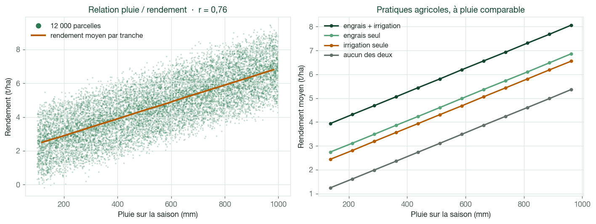
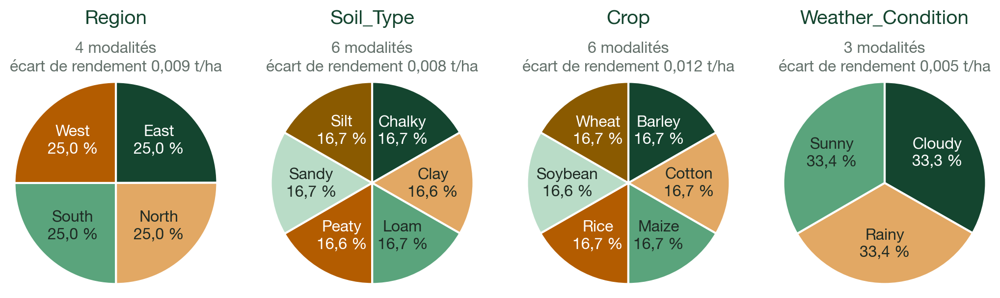
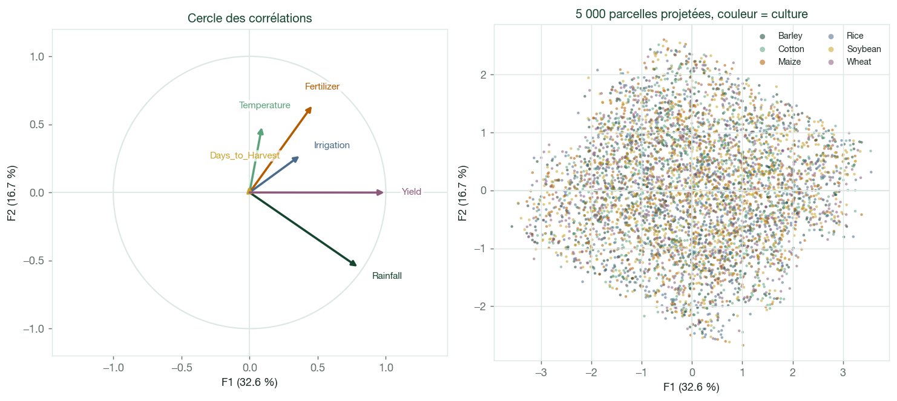
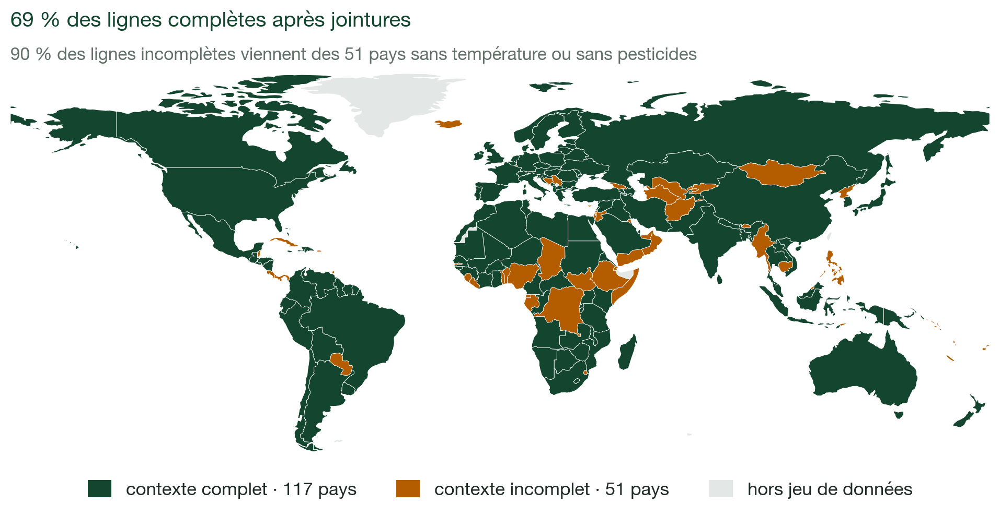
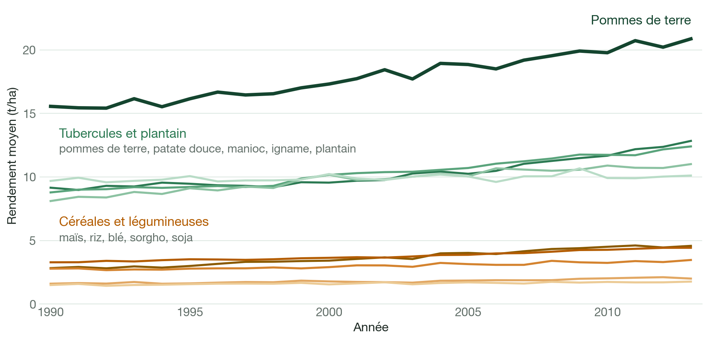
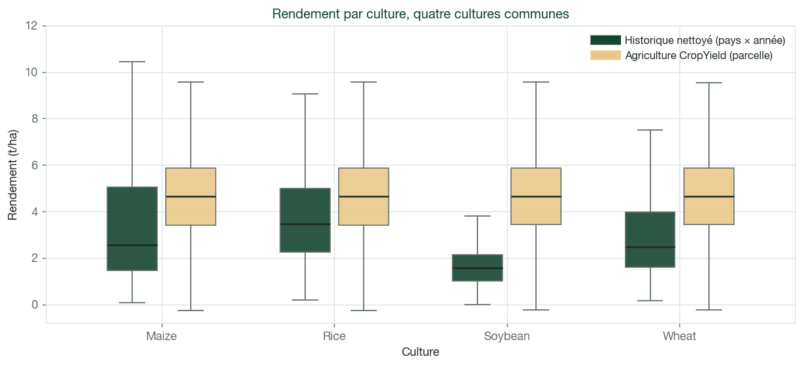
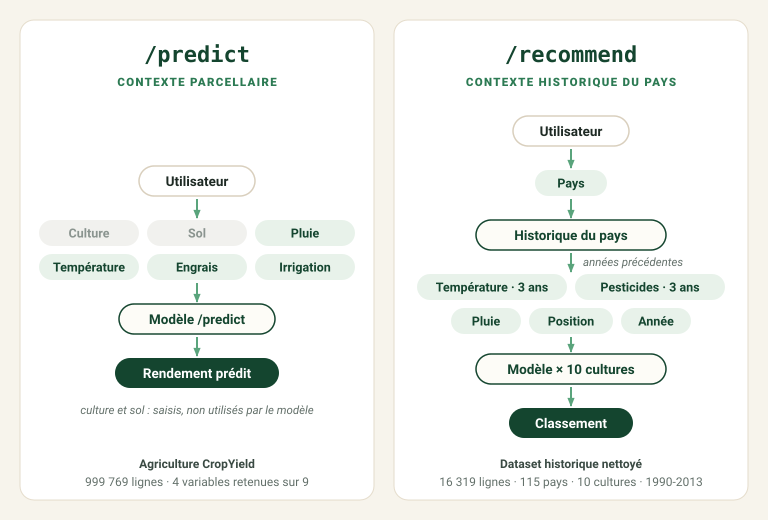
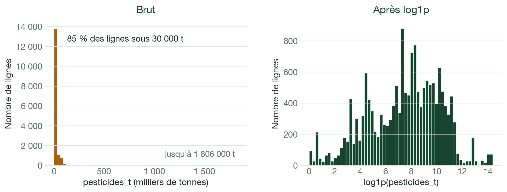

# Rapport technique — Agritech Answers

*Système de prédiction de rendement et de recommandation de cultures.*

> [!NOTE]
> Ce rapport couvre la préparation des données : contexte, exploration, ACP, nettoyage des
> sources et construction des datasets d'entraînement. La modélisation, le suivi des expériences,
> l'API et le déploiement seront ajoutés dans les prochaines versions. Aucun résultat de modèle
> n'est présenté ici.

## Sommaire

1. [Objectifs du projet](#1-objectifs-du-projet)
2. [Données disponibles](#2-données-disponibles)
3. [Analyse du dataset Agriculture CropYield](#3-analyse-du-dataset-agriculture-cropyield)
4. [Analyse du dataset CropYield Prediction](#4-analyse-du-dataset-cropyield-prediction)
5. [Comparaison des deux datasets](#5-comparaison-des-deux-datasets)
6. [Construction des datasets d'entraînement](#6-construction-des-datasets-dentraînement)
7. [Limites identifiées](#7-limites-identifiées)
8. [Suite du projet](#8-suite-du-projet)

## 1. Objectifs du projet

Agritech Answers veut proposer aux agriculteurs une application web qui répond à deux
questions. Dans la première, l'agriculteur a déjà choisi sa culture et veut connaître le
rendement attendu. Dans la seconde, il cherche justement quelle culture choisir. Cette
différence explique toute l'organisation des données décrite dans ce rapport.

### `/predict` — estimer un rendement

L'utilisateur choisit une culture et décrit sa parcelle : pluie de la saison, température
moyenne, type de sol, utilisation d'engrais et d'irrigation. Le service renvoie une estimation du
rendement en tonnes par hectare.

On travaille à l'échelle d'**une parcelle, sur une saison**.

### `/recommend` — classer les cultures

L'utilisateur choisit son pays. L'application affiche les valeurs historiques connues pour ce
pays : température, pluie et pesticides. Elles sont présentées comme des valeurs du pays, et
l'utilisateur peut les modifier pour décrire sa propre situation. Le modèle estime ensuite le
rendement des 10 cultures, et l'application les classe du rendement le plus élevé au plus faible.

Le pays n'est pas une variable du modèle : il sert seulement à préremplir les valeurs. Le
classement dépend donc des conditions renseignées, pas du nom du pays.

Ici, il faut **comparer les cultures entre elles**.

### Pourquoi deux datasets et deux modèles

Pour classer des cultures, il faut que le rendement prédit change d'une culture à l'autre. Le
dataset parcellaire convient à `/predict`, mais ses six cultures ont presque le même rendement
(section 3). Le dataset historique distingue bien les cultures, mais ne décrit aucune parcelle
(section 5).

Chaque service utilise donc son propre dataset et son propre modèle. Les lignes des deux datasets
ne sont jamais mélangées.

## 2. Données disponibles

| | **Agriculture CropYield** | **CropYield Prediction** |
|---|---|---|
| Une ligne | une parcelle sur une saison | un pays, une année, une culture |
| Volume brut | 1 000 000 lignes × 10 colonnes | 4 fichiers sources + un fichier déjà assemblé |
| Période | pas d'année | 1990-2013 |
| Géographie | 4 zones sans lieu réel (North, East, South, West) | 168 pays après jointure, 117 après nettoyage |
| Cultures | 6 | 10 |
| Variables principales | pluie, température, sol, engrais, irrigation | rendement, température, pluie, pesticides |
| Cible | `Yield_tons_per_hectare` (t/ha) | `yield_t_ha` (t/ha, converti depuis hg/ha) |
| Service | **`/predict`** | **`/recommend`** |

Le second dataset est fourni en quatre fichiers sources (`yield.csv`, `temp.csv`, `rainfall.csv`,
`pesticides.csv`) et un fichier déjà assemblé, `yield_df.csv`, qui n'est pas utilisé (section 4).

Aucune clé ne relie les deux datasets : le premier n'a ni pays ni année, et ses régions ne désignent
aucun territoire réel. Leurs variables communes ne mesurent pas non plus la même chose (section 5).

## 3. Analyse du dataset Agriculture CropYield

Le dataset compte **1 000 000 de lignes et 10 colonnes**, sans valeur manquante ni doublon. Les
types sont corrects.

La pluie, la température et `Days_to_Harvest` ont des distributions uniformes. Le rendement suit
une courbe en cloche centrée sur 4,65 t/ha. Aucune distribution n'est fortement asymétrique :
aucune transformation n'est nécessaire à ce stade.

### Variables les plus liées au rendement

| Variable | Corrélation | Relation observée |
|---|---|---|
| `Rainfall_mm` | **0,765** | la plus liée au rendement ; relation linéaire |
| `Fertilizer_Used` | **0,442** | **+1,50 t/ha** en moyenne |
| `Irrigation_Used` | **0,354** | **+1,20 t/ha** en moyenne |
| `Temperature_Celsius` | 0,086 | +0,445 t/ha du plus froid au plus chaud, de façon régulière |
| `Days_to_Harvest` | −0,003 | aucune relation visible (0,029 t/ha d'écart entre tranches) |

Sur le graphique de droite, les courbes sont presque parallèles : l'effet de l'engrais et de
l'irrigation est le même quelle que soit la pluie. Les variables d'entrée ne sont pas corrélées
entre elles (|r| ≤ 0,003), donc chaque effet peut se lire séparément.

La température a une corrélation faible, mais le rendement moyen monte régulièrement du plus froid
au plus chaud : l'effet est petit mais constant, et la variable est gardée.

### Variables sans effet visible

`Region`, `Soil_Type`, `Crop` et `Weather_Condition` sont équilibrées, mais ne changent presque pas
le rendement : **0,012 t/ha d'écart au maximum** entre modalités. Même à pluie comparable, les six
cultures restent à 0,028 t/ha les unes des autres.

> [!IMPORTANT]
> **`/recommend` ne peut pas s'appuyer sur ce dataset.** Classer six cultures qui ont le même
> rendement donnerait un ordre au hasard. C'est pour cette raison que le second dataset est
> utilisé.

### Qualité de la cible

Le rendement va de −1,15 à 9,96 t/ha, avec une moyenne et une médiane de 4,65. **231 lignes
(0,023 %) ont un rendement négatif**, ce qui est impossible. Toutes sont sans engrais ni
irrigation, et 223 ont reçu moins de 200 mm de pluie. Leur traitement est décrit à la section 6.

### Analyse en composantes principales

L'ACP sert à voir si plusieurs variables apportent la même information, ce qui permettrait d'en
utiliser moins. Elle porte sur les six variables numériques, standardisées ; les variables
catégorielles sont laissées de côté.

| Axe | F1 | F2 | F3 | F4 | F5 | F6 |
|---|---|---|---|---|---|---|
| Variance expliquée (%) | **32,58** | 16,71 | 16,68 | 16,67 | 16,62 | 0,74 |
| Cumul (%) | 32,58 | 49,29 | 65,97 | 82,64 | 99,26 | 100,00 |

Un seul axe se détache, et il faut 5 axes sur 6 pour garder 99 % de l'information.

F1 regroupe le rendement (corrélation de 0,99 avec l'axe), la pluie (0,79), l'engrais (0,46) et
l'irrigation (0,37) : c'est l'axe du rendement, qui retrouve les relations vues plus haut.
`Days_to_Harvest` porte presque seule F4.

**L'ACP ne permet pas de réduire le nombre de variables.** Une ACP utilisée avant un modèle ne peut
pas contenir la cible, sinon le modèle recevrait une partie de ce qu'il doit prédire. Refaite sans
le rendement, chaque axe explique environ 20 % de la variance et aucun ne domine : les cinq
variables d'entrée apportent chacune une information différente. L'ACP reste donc exploratoire.

**Les cultures ne se séparent pas.** Sur le graphique de droite, les six couleurs se recouvrent
complètement : leurs coordonnées moyennes sur F1 diffèrent de 0,010 au maximum, pour un écart-type
de 1,398.

## 4. Analyse du dataset CropYield Prediction

### Pourquoi refaire l'assemblage fourni

`yield_df.csv` assemble déjà les quatre sources, mais il a deux défauts.

Premier défaut : **des lignes dupliquées lors de la jointure avec la température.** Dans
`temp.csv`, un même pays et une même année peuvent avoir jusqu'à **52 lignes**. Sans moyenne
préalable, chaque ligne de rendement est recopiée autant de fois : ces pays pèsent plus lourd à
l'entraînement, et un découpage train/test aléatoire pourrait placer des copies de la même ligne
des deux côtés, ce qui crée une fuite de données.

Second défaut : **des pays perdus.** `yield_df.csv` ne garde que 99 pays, alors que **117** pays
sont présents dans les quatre sources. Une partie de ces 18 pays est perdue à cause de noms écrits
différemment d'un fichier à l'autre, comme `United States of America` et `United States`, ou
`Russian Federation` et `Russia`.

L'assemblage a donc été refait, avec des jointures sur le **code ISO3** de chaque pays plutôt que
sur son nom.

### Les quatre sources et leur préparation

| Source | Une ligne | Période | Préparation |
|---|---|---|---|
| `yield.csv` | pays, culture, année | 1961-2016 | conversion hg/ha → t/ha ; `China, mainland` gardé |
| `temp.csv` | pays, année, relevé | 1743-2013 | doublons exacts retirés, puis moyenne par pays et par année |
| `rainfall.csv` | pays, année | 1985-2017 | nom de colonne nettoyé, conversion en nombre ; aucune ligne pour 1988 et 2003 |
| `pesticides.csv` | pays, année | 1990-2016 | aucune préparation : une seule ligne par pays et par année |

La période retenue, **1990-2013**, correspond aux années communes aux quatre sources :
`pesticides.csv` commence en 1990 et `temp.csv` s'arrête en 2013.

Pour la Chine, `yield.csv` contient `China`, qui inclut Taïwan, Hong Kong et Macao, et
`China, mainland`. On garde `China, mainland`, car les autres sources traitent ces territoires à
part. Les rendements des deux entités ne diffèrent que de 0,26 % en moyenne.

### État après jointures

Les jointures partent du fichier de rendement et se font sur le code pays et l'année. Le nombre de
lignes ne change pas : **aucune ligne n'est dupliquée**.

| Caractéristique | État après jointures |
|---|---|
| Lignes | 22 679 |
| Pays | 168 |
| Cultures | 10 |
| Période | 1990-2013 (24 années) |
| Valeurs manquantes | température 19,5 %, pesticides 13,1 %, pluie 5,0 % |
| Colonnes | `iso3`, `area`, `year`, `crop`, `yield_t_ha`, `avg_temp`, `rain_mm`, `pesticides_t` |

Cet état n'est pas sauvegardé : il sert de point de départ au nettoyage.

### Trois points d'attention

**La pluie ne change pas d'une année à l'autre.** Pour chaque pays, `rain_mm` a la même valeur sur
les 24 années : c'est une normale climatique, la pluie habituelle du pays, et non la pluie mesurée
chaque année. Elle ne peut donc montrer aucune évolution dans le temps.

**Les pays présents changent selon l'année** : 138 pays en 1990, 168 en 2013. La température
moyenne des pays *baisse* de 1,16 °C entre 1990 et 2013, alors qu'elle augmente de +0,36 °C sur les
108 pays renseignés chaque année : la baisse vient donc de la composition du dataset, pas du climat.
Les hausses de rendement restent visibles à pays constants (maïs +41,7 %, blé +18,7 %). Le dataset
nettoyé garde ce phénomène : 97 pays en 1990, 117 en 2013.

**Les températures et les pesticides manquent pour des pays entiers**, sur toute la période : aucune
donnée du pays ne permet de les compléter. Ces pays concentrent l'essentiel des lignes incomplètes ;
les autres sont surtout des lignes de 2003, sans pluie.

### Nettoyage

Deux règles, sans inventer de valeurs, transforment l'état après jointures en dataset historique
nettoyé.

**Pluie : reprise de la valeur du pays.** `rainfall.csv` n'a aucune ligne pour 2003. Comme la pluie
d'un pays est la même chaque année, une année sans valeur reprend la valeur connue du pays :
953 lignes sont complétées, 947 de 2003 et 6 des Bahamas en 1990-1991, sans modifier les valeurs
existantes. La Nouvelle-Calédonie, qui n'a aucune valeur de pluie, est retirée avec les pays sans
température.

**Retrait des pays sans température ou sans pesticides.** 36 pays n'ont aucune température et
24 aucun pesticide, dont 9 dans les deux cas : **51 pays sont retirés**, soit 6 322 lignes.
Reprendre les valeurs d'un pays voisin reviendrait à inventer leur contexte.

| Caractéristique | Dataset historique nettoyé |
|---|---|
| Lignes | **16 357** (une seule ligne par pays, année et culture) |
| Pays | **117** |
| Cultures | **10** |
| Période | **1990-2013** |
| Valeurs manquantes | **aucune** |
| Fichier | `data/processed/crop_yield_clean.csv` |

Ce fichier sert de base à la comparaison des deux datasets (section 5) et au dataset
d'entraînement `/recommend` (section 6).

### Évolution du rendement par culture

Le dataset couvre 24 années : on regarde si les écarts entre cultures restent stables dans le
temps.

Les niveaux de rendement varient fortement d'une culture à l'autre. Les dix cultures progressent,
mais ces écarts se retrouvent sur toute la période. C'est ce signal, absent du dataset parcellaire,
qui permet d'envisager `/recommend`. Il montre que l'information existe dans les données, pas qu'un
modèle saura bien l'utiliser.

## 5. Comparaison des deux datasets

Quatre cultures sont communes aux deux datasets : maïs, riz, soja et blé, après harmonisation de
deux noms. La comparaison porte sur ces cultures : 8 259 lignes du dataset historique nettoyé
(117 pays) et 666 638 lignes du dataset parcellaire.

### Trois variables communes, trois lectures différentes

| Variable | Agriculture CropYield | Historique nettoyé |
|---|---|---|
| Rendement | −1,15 à 9,96 t/ha, médiane 4,65 | 0 à 20,8 t/ha, médiane 2,38 |
| Température | 15 à 40 °C, médiane 27,5 | 1,3 à 30,4 °C, médiane 19,1 |
| Pluie | 100 à 1 000 mm sur la saison | 51 à 3 240 mm/an, normale climatique |
| Corrélation pluie / rendement | **+0,764** | **−0,104** |
| Corrélation température / rendement | +0,085 | −0,315 |

*Valeurs calculées sur les quatre cultures communes.*

Les corrélations changent de signe, mais elles ne mesurent pas la même chose. Dans le dataset
parcellaire, une ligne est une parcelle : plus il pleut, plus le rendement monte. Dans
l'historique, une ligne correspond à un pays, une année et une culture : le signe négatif compare
des pays entre eux, pas l'effet de la pluie sur une parcelle. Les deux datasets ne se contredisent
donc pas.

### Les cultures se distinguent-elles ?

C'est la principale différence entre les deux datasets : l'historique montre quatre niveaux bien
distincts, du soja (médiane 1,58 t/ha) au riz (3,46 t/ha), alors que le dataset parcellaire donne
quatre boîtes presque identiques.

On retrouve cette différence à température comparable, entre 15 et 30 °C :

| Tranche de température | Écart max entre cultures — parcellaire | Écart max entre cultures — historique |
|---|---|---|
| 15-20 °C | 0,01 t/ha | **3,38 t/ha** |
| 20-25 °C | 0,03 t/ha | **1,45 t/ha** |
| 25-30 °C | 0,02 t/ha | **1,70 t/ha** |

Dans l'historique, les cultures sont aussi liées au climat des pays : les lignes « blé » ont une
température médiane de 16,3 °C et 691 mm de pluie, celles du riz 21,4 °C et 1 146 mm. Le dataset
parcellaire donne 27,5 °C et 550 mm pour les quatre cultures.

### Choix retenu

> **Aucune fusion ligne à ligne.** Les deux jeux n'ont ni la même unité d'observation, ni les mêmes
> plages de valeurs, ni la même définition de la pluie. Ils répondent à deux questions différentes,
> avec deux modèles distincts.

Dans `/recommend`, le pays sert seulement à **préremplir le contexte**, que l'utilisateur peut
modifier. S'il était une variable du modèle, celui-ci apprendrait surtout un rendement moyen par
pays, et le classement ne dépendrait plus des conditions renseignées.

## 6. Construction des datasets d'entraînement

À ce stade, il n'y a ni encodage, ni standardisation, ni imputation. Ces étapes seront apprises
plus tard sur les seules données d'entraînement, dans un pipeline, pour éviter une fuite de
données.

### `/predict` — 999 769 lignes, 9 variables candidates

**Cible :** `Yield_tons_per_hectare`.

| Configuration métier envisagée | Raison |
|---|---|
| `Rainfall_mm` | variable la plus liée au rendement |
| `Temperature_Celsius` | effet faible mais régulier |
| `Fertilizer_Used` | +1,50 t/ha |
| `Irrigation_Used` | +1,20 t/ha |
| `Crop` | choisie par l'utilisateur, même sans effet mesuré |
| `Soil_Type` | connue de l'utilisateur, même sans effet mesuré |

Trois autres variables sont conservées comme candidates : `Region`, `Weather_Condition` et
`Days_to_Harvest`. Elles servent à mesurer ce qu'elles apportent, mais ne seront pas forcément
utilisables dans l'application : `Region` ne correspond à aucun lieu réel, et `Weather_Condition` et
`Days_to_Harvest` ne sont connues qu'après la saison. La sélection finale sera décidée pendant la
modélisation, selon les performances, la disponibilité des variables au moment de prédire et leur
pertinence métier.

**Les 231 rendements négatifs sont retirés du dataset d'entraînement.** Les remplacer par zéro
reviendrait à inventer un rendement. Leur retrait ne change la moyenne de la cible que de 0,001 t/ha.
Ces lignes seront réutilisées après l'entraînement pour observer le rendement que le modèle leur prédit.
Leurs cibles invalides ne serviront pas à mesurer les performances.
Aucune autre ligne n'est retirée : les autres valeurs atypiques sont gardées.

### `/recommend` — du dataset nettoyé au dataset d'entraînement

**Cible :** `yield_t_ha`.

- **Après jointures** — 22 679 lignes · 168 pays  
  *Nettoyage : −6 322 lignes · −51 pays*
- **Dataset historique nettoyé** — 16 357 lignes · 117 pays · 10 cultures · 1990–2013  
  `crop_yield_clean.csv`
- **Dataset `/recommend`** — 15 664 lignes · 117 pays · 10 cultures · 1991–2013  
  *Après création des variables historiques : −693 premières observations*

| Colonne | Rôle |
|---|---|
| `crop` | candidate : la culture à classer |
| `temp_hist` | candidate : température moyenne des années précédentes |
| `rain_mm` | candidate : pluie habituelle du pays |
| `pest_hist` | candidate : pesticides des années précédentes, en tonnes |
| `log_pest_hist` | candidate : même moyenne, en logarithme |
| `iso3`, `area` | **hors modèle** : préremplissage des valeurs du pays, analyses |
| `year` | **hors modèle** : séparation des années pour l'entraînement et le test |

La configuration envisagée utilise `crop`, `temp_hist`, `rain_mm` et une seule version des
pesticides : `pest_hist` et `log_pest_hist` sont conservées pour comparer les deux versions pendant
la modélisation, pas pour être utilisées ensemble.

**Organisation dans le temps.** Les années avant 2013 servent à l'entraînement et à la validation,
et 2013 est gardée pour le test final. L'application est pensée pour une utilisation en 2014, avec
les données connues jusqu'en 2013. Pour prédire une année *t*, on n'utilise donc que les années
précédentes, à l'entraînement comme lors de l'utilisation : sinon, le modèle apprendrait avec des
valeurs dont il ne disposera pas au moment de prédire.

`temp_hist` est la moyenne de la température des trois années précédentes au plus, pays par pays.
Pour les pesticides, on calcule la même moyenne, puis on applique `log1p`. Pour 2013, les moyennes
portent sur 2010-2012 ; en 2014, elles porteront sur 2011-2013.

**Les 693 lignes retirées sont exactement celles de la première année de chaque pays**, qui n'a pas
d'année précédente. Aucune autre ligne n'est perdue.

| Première année dans les données | Pays | Lignes |
|---|---|---|
| 1990 | 97 pays | 605 |
| 1992 | 14 pays de l'ex-URSS et de l'ex-Yougoslavie | 62 |
| 1993 | Tchéquie, Slovaquie, Érythrée | 13 |
| 2000 | Belgique | 3 |
| 2006 | Monténégro | 3 |
| 2012 | Soudan | 7 |

Le dataset d'entraînement commence en 1991, car 97 pays commencent en 1990.

Trois contrôles vérifient qu'aucune information future n'est utilisée : les années se suivent pour
chaque pays, la première année de chaque pays n'a pas de valeurs historiques, et la moyenne
recalculée à la main sur 300 couples pays-année tirés au hasard donne exactement les mêmes valeurs,
pour la température comme pour les pesticides.

Le logarithme est utile pour les pesticides : en valeur brute, presque toutes les lignes sont
regroupées à gauche de l'échelle. Après `log1p`, la corrélation avec le rendement passe de
0,07-0,26 à **0,25-0,56** selon la culture.

## 7. Limites identifiées

| Limite | Conséquence |
|---|---|
| Le dataset de `/predict` n'a ni pays ni année, et `Region` ne correspond à aucun lieu | les estimations ne peuvent pas être rattachées à un lieu ou à une saison précise |
| Les 6 cultures y ont le même rendement | la culture n'apporte presque aucune information pour prédire le rendement |
| `/recommend` apprend sur des données de pays | les valeurs préremplies sont nationales ; l'utilisateur peut les modifier, mais le modèle a appris sur des moyennes de pays, pas sur des parcelles |
| `rain_mm` est une normale climatique | la valeur préremplie est la même quelle que soit l'année ; seule une saisie de l'utilisateur la change |
| `pesticides_t` est un tonnage national | il dépend de la taille du pays et ne décrit pas la pratique d'un agriculteur |
| 117 pays seulement | les valeurs historiques ne peuvent être préremplies que pour ces pays ; le comportement de l'application pour un autre pays reste à décider |
| 39 % des couples pays-culture n'existent pas dans l'historique | une culture peut être classée pour un pays où elle n'a jamais été observée ; igname, plantain et manioc sont rarement observés sous 16-17 °C |
| Cultures inégalement représentées dans le dataset d'entraînement `/recommend` | igname : 547 lignes et 25 pays ; plantain : 602 lignes et 27 pays ; maïs : 2 407 lignes et 109 pays |
| Niveaux de rendement très différents selon la culture | en t/ha, les tubercules passent devant les céréales (pomme de terre : médiane 16 t/ha ; sorgho : 1,3) ; le classement reflète d'abord cette différence |

## 8. Suite du projet

Le dataset historique nettoyé et les deux datasets d'entraînement sont produits et vérifiés par des
assertions dans les notebooks 04 et 06. Les prochaines étapes sont :

- entraîner et comparer des modèles de régression pour les deux services ;
- comparer les variables candidates, puis retenir la configuration finale selon les performances,
  leur disponibilité au moment de prédire et leur pertinence métier ;
- pour `/recommend`, entraîner et valider sur les années avant 2013, puis tester sur 2013 ;
- comparer `/recommend` à une baseline simple, qui classe les cultures selon leurs rendements
  passés, pour vérifier que le modèle apporte réellement quelque chose ;
- suivre les expériences dans MLflow ;
- signaler les recommandations faites dans des conditions climatiques inhabituelles pour une
  culture ;
- décider du comportement de l'application pour un pays hors des 117 pays.

Ces travaux seront ajoutés dans une prochaine version du rapport.

---

*Analyses et code : notebooks `01` à `06` du dépôt. Figures régénérables avec
`scripts/make_report_figures.py`, rapport HTML avec `scripts/build_report.py`.*
