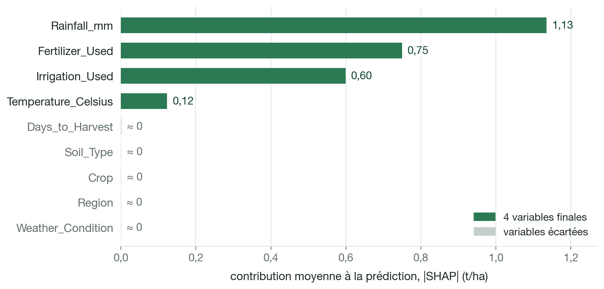
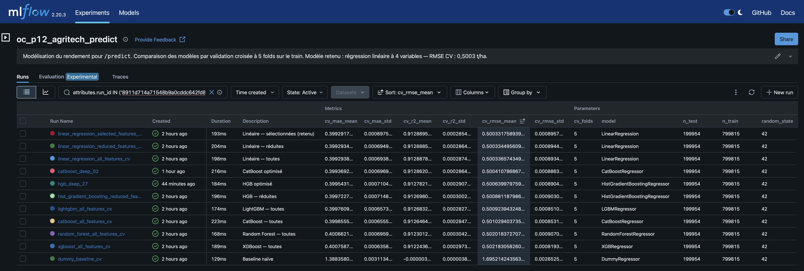

# Rapport technique — Agritech Answers

*Système de prédiction de rendement et de recommandation de cultures.*

> [!NOTE]
> Ce rapport couvre la préparation des données, la modélisation complète de `/predict` (sélection,
> évaluation finale sur le jeu de test et sauvegarde du modèle) et la première baseline `/recommend`.
> La suite de la modélisation `/recommend`, son évaluation finale, l'API et le déploiement seront
> ajoutés dans les prochaines versions.

## Sommaire

1. [Objectifs du projet](#1-objectifs-du-projet)
2. [Données disponibles](#2-données-disponibles)
3. [Analyse du dataset Agriculture CropYield](#3-analyse-du-dataset-agriculture-cropyield)
4. [Analyse du dataset CropYield Prediction](#4-analyse-du-dataset-cropyield-prediction)
5. [Comparaison des deux datasets](#5-comparaison-des-deux-datasets)
6. [Construction des datasets d'entraînement](#6-construction-des-datasets-dentraînement)
7. [Modélisation de `/predict`](#7-modélisation-de-predict)
8. [Première modélisation de `/recommend`](#8-première-modélisation-de-recommend)
9. [Limites identifiées](#9-limites-identifiées)
10. [Suite du projet](#10-suite-du-projet)

[Annexes](#annexes)

- [`/predict` — Grilles d'hyperparamètres](#predict--grilles-dhyperparamètres)

## 1. Objectifs du projet

Agritech Answers veut proposer aux agriculteurs une application web qui répond à deux questions :

- **`/predict`** : l'agriculteur a déjà choisi sa culture et veut connaître le rendement attendu ;
- **`/recommend`** : il cherche quelle culture choisir.

Cette différence explique toute l'organisation des données décrite dans ce rapport.

### `/predict` — estimer un rendement

On travaille à l'échelle d'**une parcelle, sur une saison**. L'utilisateur décrit sa parcelle, et le
service renvoie une estimation du rendement en tonnes par hectare.

| Information | Saisie dans l'application | Utilisée par le modèle final |
|---|---|---|
| Pluie de la saison (`Rainfall_mm`) | oui | **oui** |
| Température moyenne (`Temperature_Celsius`) | oui | **oui** |
| Engrais, oui ou non (`Fertilizer_Used`) | oui | **oui** |
| Irrigation, oui ou non (`Irrigation_Used`) | oui | **oui** |
| Culture | oui | non |
| Type de sol | oui | non |

La culture et le type de sol restent demandés pour décrire la parcelle, mais ils ne changent pas
l'estimation : le modèle final n'utilise que les **4 variables sélectionnées**, qui portent le signal (section 7).

### `/recommend` — classer les cultures

L'utilisateur choisit son pays. L'application affiche les valeurs historiques connues pour ce
pays : température, pluie et pesticides. Elles sont présentées comme des valeurs du pays, et
l'utilisateur peut les modifier pour décrire sa propre situation. Le modèle estime ensuite le
rendement des 10 cultures, et l'application les classe du rendement le plus élevé au plus faible.

Le pays sert d'abord à préremplir les valeurs. Son code (`iso3`) et l'année (`year`) seront aussi
testés comme variables du modèle, pour vérifier s'ils apportent une information que les conditions
ne décrivent pas. Le classement doit rester sensible aux conditions renseignées.

Ici, il faut **comparer les cultures entre elles**.

### Pourquoi deux datasets et deux modèles

Pour classer des cultures, il faut que le rendement prédit change d'une culture à l'autre. Le
dataset parcellaire convient à `/predict`, mais ses six cultures ont presque le même rendement
(section 3). Le dataset historique distingue bien les cultures, mais ne décrit aucune parcelle
(section 5).

Chaque service utilise donc son propre dataset et son propre modèle. Les lignes des deux datasets
ne sont jamais mélangées.

## 2. Données disponibles

| | **Agriculture CropYield** | **CropYield Prediction** |
|---|---|---|
| Une ligne | une parcelle sur une saison | un pays, une année, une culture |
| Volume brut | 1 000 000 lignes × 10 colonnes | 4 fichiers sources + un fichier déjà assemblé |
| Période | pas d'année | 1990-2013 |
| Géographie | 4 zones sans lieu réel (North, East, South, West) | 168 pays après jointure, 115 après nettoyage |
| Cultures | 6 | 10 |
| Variables principales | pluie, température, sol, engrais, irrigation | rendement, température, pluie, pesticides |
| Cible | `Yield_tons_per_hectare` (t/ha) | `yield_t_ha` (t/ha, converti depuis hg/ha) |
| Service | **`/predict`** | **`/recommend`** |

Le second dataset est fourni en quatre fichiers sources (`yield.csv`, `temp.csv`, `rainfall.csv`,
`pesticides.csv`) et un fichier déjà assemblé, `yield_df.csv`, qui n'est pas utilisé (section 4).

Aucune clé ne relie les deux datasets : le premier n'a ni pays ni année, et ses régions ne désignent
aucun territoire réel. Leurs variables communes ne mesurent pas non plus la même chose (section 5).

## 3. Analyse du dataset Agriculture CropYield

**1 000 000 lignes et 10 colonnes**, sans valeur manquante ni doublon, avec des types corrects. La
pluie, la température et `Days_to_Harvest` sont uniformes ; le rendement suit une courbe en cloche
centrée sur 4,65 t/ha. Aucune transformation n'est nécessaire à ce stade.

### Variables les plus liées au rendement

| Variable | Corrélation | Relation observée |
|---|---|---|
| `Rainfall_mm` | **0,765** | la plus liée au rendement ; relation linéaire |
| `Fertilizer_Used` | **0,442** | rendement moyen supérieur de **1,50 t/ha** avec engrais |
| `Irrigation_Used` | **0,354** | rendement moyen supérieur de **1,20 t/ha** avec irrigation |
| `Temperature_Celsius` | 0,086 | +0,445 t/ha du plus froid au plus chaud, de façon régulière |
| `Days_to_Harvest` | −0,003 | aucune relation visible (0,029 t/ha d'écart entre tranches) |

- Les courbes de droite sont presque parallèles : l'écart de rendement moyen associé à l'engrais et
  à l'irrigation reste le même quel que soit le niveau de pluie.
- Les variables d'entrée ne sont pas corrélées entre elles (|r| ≤ 0,003) : chaque relation se lit
  séparément.
- La température a une corrélation faible, mais une relation petite et régulière avec le rendement :
  elle est gardée.

### Variables sans effet visible

`Region`, `Soil_Type`, `Crop` et `Weather_Condition` sont équilibrées, mais ne changent presque pas
le rendement : **0,012 t/ha d'écart au maximum** entre modalités. À pluie comparable, les six
cultures restent à 0,028 t/ha les unes des autres.

> [!IMPORTANT]
> **`/recommend` ne peut pas s'appuyer sur ce dataset.** Classer six cultures qui ont le même
> rendement donnerait un ordre au hasard. C'est pour cette raison que le second dataset est
> utilisé.

### Qualité de la cible

Le rendement va de −1,15 à 9,96 t/ha, avec une moyenne et une médiane de 4,65. **231 lignes
(0,023 %) ont un rendement négatif**, ce qui est impossible : toutes sont sans engrais ni
irrigation, et 223 ont reçu moins de 200 mm de pluie. Leur traitement est décrit en section 6.

### Analyse en composantes principales

ACP exploratoire sur les six variables numériques standardisées, pour voir si plusieurs variables
apportent la même information.

| Axe | F1 | F2 | F3 | F4 | F5 | F6 |
|---|---|---|---|---|---|---|
| Variance expliquée (%) | **32,58** | 16,71 | 16,68 | 16,67 | 16,62 | 0,74 |
| Cumul (%) | 32,58 | 49,29 | 65,97 | 82,64 | 99,26 | 100,00 |

- **Un seul axe se détache**, et il faut 5 axes sur 6 pour garder 99 % de l'information. F1 est l'axe
  du rendement (corrélation de 0,99), avec la pluie (0,79), l'engrais (0,46) et l'irrigation (0,37) ;
  `Days_to_Harvest` porte presque seule F4.
- **Aucune réduction de variables possible.** Une ACP placée avant un modèle ne peut pas contenir la
  cible. Sans le rendement, chaque axe explique environ 20 % de la variance : les cinq variables
  d'entrée apportent chacune une information différente. L'ACP reste exploratoire.
- **Les cultures ne se séparent pas** : leurs coordonnées moyennes sur F1 diffèrent de 0,010 au
  maximum, pour un écart-type de 1,398.

## 4. Analyse du dataset CropYield Prediction

### Pourquoi refaire l'assemblage fourni

`yield_df.csv` assemble déjà les quatre sources, mais avec deux défauts :

| Défaut | Cause | Conséquence |
|---|---|---|
| **Lignes dupliquées** | `temp.csv` compte jusqu'à **52 lignes** par pays et par année, non moyennées | certains pays pèsent plus lourd, et des copies d'une même ligne peuvent tomber dans le train et le test : fuite de données |
| **Pays perdus** | noms écrits différemment d'un fichier à l'autre, par exemple `United States of America` et `United States` | 99 pays gardés, alors que **117** sont présents dans les quatre sources |

L'assemblage est donc refait, avec des jointures sur le **code ISO3** de chaque pays plutôt que sur
son nom.

### Les quatre sources et leur préparation

| Source | Une ligne | Période | Préparation |
|---|---|---|---|
| `yield.csv` | pays, culture, année | 1961‑2016 | conversion hg/ha → t/ha ; `China, mainland` gardé |
| `temp.csv` | pays, année, relevé | 1743‑2013 | doublons exacts retirés, puis moyenne par pays et par année |
| `rainfall.csv` | pays, année | 1985‑2017 | nom de colonne nettoyé, conversion en nombre ; aucune ligne pour 1988 et 2003 ; même valeur pour un pays sur toute la période 1990‑2013 |
| `pesticides.csv` | pays, année | 1990‑2016 | aucune préparation : une seule ligne par pays et par année |

- **Période retenue : 1990-2013**, les années communes aux quatre sources (`pesticides.csv` commence
  en 1990, `temp.csv` s'arrête en 2013).
- **Chine :** on garde `China, mainland` plutôt que `China`, qui inclut Taïwan, Hong Kong et Macao,
  traités à part dans les autres sources. Les rendements des deux entités diffèrent de 0,26 % en
  moyenne.

### État après jointures

Les jointures partent du fichier de rendement, sur le code pays et l'année : **aucune ligne n'est
dupliquée**. Cet état n'est pas sauvegardé ; il sert de point de départ au nettoyage.

| Caractéristique | État après jointures |
|---|---|
| Lignes | 22 679 |
| Pays | 168 |
| Cultures | 10 |
| Période | 1990-2013 (24 années) |
| Valeurs manquantes | température 19,5 %, pesticides 13,1 %, pluie 5,0 % |
| Colonnes | `iso3`, `area`, `year`, `crop`, `yield_t_ha`, `avg_temp`, `rain_mm`, `pesticides_t` |

### Trois points d'attention

- **La pluie est fixe par pays.** Pour chaque pays, `rainfall.csv` donne la même valeur de pluie sur
  toute la période : `rain_mm` ne varie pas d'une année à l'autre et ne décrit pas la pluie de chaque
  année.
- **Les pays présents changent selon l'année** : 138 en 1990, 168 en 2013. La température moyenne
  *baisse* de 1,16 °C sur la période, alors qu'elle augmente de 0,36 °C sur les 108 pays présents
  chaque année : la baisse vient de la composition du dataset, pas du climat. Les hausses de
  rendement restent visibles à pays constants (maïs +41,7 %, blé +18,7 %). Le dataset nettoyé garde
  ce phénomène : 97 pays en 1990, 115 en 2013.
- **La température et les pesticides manquent pour des pays entiers**, sur toute la période. Les
  autres lignes incomplètes sont surtout des lignes de 2003, sans pluie.

### Nettoyage

Trois règles transforment l'état après jointures en dataset historique nettoyé, sans inventer de
valeurs :

| Règle | Traitement | Lignes | Pays |
|---|---|---:|---:|
| Pluie absente certaines années | la valeur connue du pays est reprise (947 lignes de 2003, 6 des Bahamas en 1990-1991) | 953 complétées | — |
| Pays sans température ou sans pesticides | pays retirés : 36 sans température, 24 sans pesticides, dont 9 dans les deux cas ; la Nouvelle-Calédonie, sans aucune pluie, en fait partie | −6 322 | −51 |
| Pluie erronée | Monténégro et Soudan retirés plutôt que corrigés arbitrairement | −38 | −2 |

- **Pays incomplets :** reprendre les valeurs d'un pays voisin reviendrait à inventer leur contexte.
- **Pluie erronée :** 14 entités de `rainfall.csv` portent exactement la pluie d'une entité proche
  dans l'ordre alphabétique, par exemple le Soudan (1 712 mm, valeur du Sri Lanka) ou le Monténégro
  (241 mm, valeur de la Mongolie), ce que confirme la base de la Banque mondiale. Faute de
  correction issue de la même version de la source, les deux pays encore présents sont retirés ; le
  détail est dans `data/README.md`.

| Caractéristique | Dataset historique nettoyé |
|---|---|
| Lignes | **16 319** (une seule ligne par pays, année et culture) |
| Pays | **115** |
| Cultures | **10** |
| Période | **1990-2013** |
| Valeurs manquantes | **aucune** |
| Fichier | `data/processed/crop_yield_clean.csv` |

Ce fichier sert de base à la comparaison des deux datasets (section 5) et au dataset
d'entraînement `/recommend` (section 6).

### Évolution du rendement par culture

Les niveaux de rendement varient fortement d'une culture à l'autre, et ces écarts se retrouvent sur
les 24 années, alors que les dix cultures progressent. C'est ce signal, absent du dataset
parcellaire, qui permet d'envisager `/recommend` : il montre que l'information existe dans les
données, pas qu'un modèle saura bien l'utiliser.

## 5. Comparaison des deux datasets

Quatre cultures sont communes aux deux datasets : maïs, riz, soja et blé, après harmonisation de
deux noms. La comparaison porte sur ces cultures : 8 237 lignes du dataset historique nettoyé
(115 pays) et 666 638 lignes du dataset parcellaire.

### Trois variables communes, trois lectures différentes

| Variable | Agriculture CropYield | Historique nettoyé |
|---|---|---|
| Rendement | −1,15 à 9,96 t/ha, médiane 4,65 | 0 à 20,8 t/ha, médiane 2,38 |
| Température | 15 à 40 °C, médiane 27,5 | 1,3 à 30,4 °C, médiane 19,1 |
| Pluie | 100 à 1 000 mm sur la saison | 51 à 3 240 mm/an, valeur fixe par pays |
| Corrélation pluie / rendement | **+0,764** | **−0,104** |
| Corrélation température / rendement | +0,085 | −0,315 |

*Valeurs calculées sur les quatre cultures communes.*

Les corrélations changent de signe, mais elles ne mesurent pas la même chose. Dans le dataset
parcellaire, une ligne est une parcelle : plus il pleut, plus le rendement monte. Dans
l'historique, une ligne correspond à un pays, une année et une culture : le signe négatif compare
des pays entre eux, pas l'effet de la pluie sur une parcelle. Les deux datasets ne se contredisent
donc pas.

### Les cultures se distinguent-elles ?

C'est la principale différence entre les deux datasets : l'historique montre quatre niveaux bien
distincts, du soja (médiane 1,58 t/ha) au riz (3,47 t/ha), alors que le dataset parcellaire donne
quatre boîtes presque identiques.

On retrouve cette différence à température comparable, entre 15 et 30 °C :

| Tranche de température | Écart max entre cultures — parcellaire | Écart max entre cultures — historique |
|---|---|---|
| 15-20 °C | 0,01 t/ha | **3,38 t/ha** |
| 20-25 °C | 0,03 t/ha | **1,45 t/ha** |
| 25-30 °C | 0,02 t/ha | **1,70 t/ha** |

Dans l'historique, les cultures sont aussi liées au climat des pays : les lignes « blé » ont une
température médiane de 16,4 °C et 691 mm de pluie, celles du riz 21,3 °C et 1 146 mm. Le dataset
parcellaire donne 27,5 °C et 550 mm pour les quatre cultures.

### Choix retenu

> **Aucune fusion ligne à ligne.** Les deux jeux n'ont ni la même unité d'observation, ni les mêmes
> plages de valeurs, ni la même définition de la pluie. Ils répondent à deux questions différentes,
> avec deux modèles distincts.

Dans `/recommend`, le pays sert d'abord à **préremplir le contexte**, que l'utilisateur peut
modifier. Utilisé aussi comme variable, il pourrait capter des différences entre pays que les
conditions ne décrivent pas ; mais le modèle risquerait alors d'apprendre surtout un rendement moyen
par pays, au détriment des conditions renseignées. Son apport sera mesuré avant toute décision.

## 6. Construction des datasets d'entraînement

Pas d'encodage, de standardisation ni d'imputation à ce stade : ces étapes sont apprises plus tard,
sur les seules données d'entraînement, dans un pipeline, pour éviter une fuite de données.

### `/predict` — 999 769 lignes, 9 variables candidates

**Cible :** `Yield_tons_per_hectare`.

| Variables candidates conservées avant modélisation | Raison | Modèle final (section 7) |
|---|---|---|
| `Rainfall_mm` | variable la plus liée au rendement | **retenue** |
| `Temperature_Celsius` | relation faible mais régulière | **retenue** |
| `Fertilizer_Used` | rendement moyen supérieur de 1,50 t/ha avec engrais | **retenue** |
| `Irrigation_Used` | rendement moyen supérieur de 1,20 t/ha avec irrigation | **retenue** |
| `Crop` | choisie par l'utilisateur, même sans effet mesuré | écartée |
| `Soil_Type` | connue de l'utilisateur, même sans effet mesuré | écartée |
| `Region` | apport à mesurer ; ne correspond à aucun lieu réel | écartée |
| `Weather_Condition` | apport à mesurer ; disponibilité selon le moment de la prédiction | écartée |
| `Days_to_Harvest` | apport à mesurer ; disponibilité selon le moment de la prédiction | écartée |

Toutes les variables sont gardées pour mesurer leur apport pendant la modélisation. La section 7
montre qu'aucune combinaison ne fait mieux que les **4 variables sélectionnées** : pluie, température,
engrais et irrigation.

- **Les 231 rendements négatifs sont retirés.** Les remplacer par zéro reviendrait à inventer un
  rendement, et leur retrait ne change la moyenne de la cible que de 0,001 t/ha. Ils servent
  seulement à observer la prédiction du modèle final (section 7), jamais à mesurer ses
  performances.
- **Aucune autre ligne n'est retirée** : les autres valeurs atypiques sont gardées.

### `/recommend` — du dataset nettoyé au dataset d'entraînement

**Cible :** `yield_t_ha`.

| Étape | Lignes | Pays | Période |
|---|---:|---:|---|
| Après jointures | 22 679 | 168 | 1990-2013 |
| Dataset historique nettoyé (`crop_yield_clean.csv`) | 16 319 | 115 | 1990-2013 |
| Dataset `/recommend`, après création des variables historiques | 15 636 | 115 | 1991-2013 |

| Colonne | Rôle |
|---|---|
| `crop` | candidate : la culture à classer |
| `temp_hist` | candidate : température moyenne des années précédentes |
| `rain_mm` | candidate : valeur de pluie fixe par pays |
| `pest_hist` | candidate : pesticides des années précédentes, en tonnes |
| `log_pest_hist` | candidate : même moyenne, en logarithme |
| `iso3` | préremplissage des valeurs du pays ; **à tester** comme variable |
| `area` | **hors modèle** : nom du pays, pour les analyses |
| `year` | séparation des années pour l'entraînement et le test ; **à tester** comme variable |

La configuration de départ utilise `crop`, `temp_hist`, `rain_mm` et une seule version des
pesticides à la fois : `pest_hist` et `log_pest_hist` sont comparées pendant la modélisation.

**Organisation dans le temps.** L'application est pensée pour 2014, avec les données connues
jusqu'en 2013 : 2013 est gardée pour le test final, et les années précédentes servent à
l'entraînement et à la validation. Pour prédire une année *t*, on n'utilise que les années
précédentes, à l'entraînement comme lors de l'utilisation.

- `temp_hist` et `pest_hist` sont les moyennes des trois années précédentes au plus, pays par pays :
  2010‑2012 pour prédire 2013. `log_pest_hist` applique `log1p` à cette moyenne.
- Les **683 lignes retirées** sont les premières années de chaque pays, qui n'ont pas d'année
  précédente ; le dataset commence donc en 1991.
- Trois contrôles vérifient qu'aucune information future n'est utilisée, dont un recalcul à la main
  des moyennes sur 300 couples pays-année tirés au hasard.

Le logarithme est utile pour les pesticides : en valeur brute, presque toutes les lignes sont
regroupées à gauche de l'échelle. Après `log1p`, la corrélation avec le rendement passe de
0,07-0,26 à **0,26-0,56** selon la culture.

## 7. Modélisation de `/predict`

La modélisation suit cinq étapes, toutes avec le même protocole :

1. référence et protocole (notebook 07) ;
2. sélection des features et feature engineering (notebook 08) ;
3. modèles non linéaires sur les deux jeux de variables, puis vérification du feature engineering
   (notebook 09) ;
4. tuning (notebook 10) ;
5. évaluation finale sur le jeu de test et sauvegarde du modèle (notebook 11).

### Protocole

- **Découpage.** Les 999 769 lignes, après le retrait des 231 rendements négatifs, sont découpées une
  fois pour toutes en 80 % d'entraînement (799 815 lignes) et 20 % de test (199 954 lignes), avec
  `random_state=42`. Le tirage est aléatoire : le dataset n'a ni date ni année.
- **Rôle du test.** **Le jeu de test n'a servi à aucun choix de modèle, de variable ou
  d'hyperparamètre** : il sert uniquement à l'évaluation finale du modèle retenu.
- **Comparaisons.** Validation croisée `KFold(n_splits=5, shuffle=True, random_state=42)` sur le jeu
  d'entraînement : 639 852 lignes d'apprentissage et 159 963 d'évaluation par fold, mêmes folds pour
  tous les modèles. Le score est la moyenne des 5 folds.
- **Métriques.** RMSE (t/ha, pénalise les grosses erreurs) et R² (part de la variance expliquée) sont
  les métriques principales ; la MAE (t/ha) les complète.
- **Pipeline.** Variables catégorielles encodées par <code class="cat">OneHotEncoder(handle_unknown="ignore")</code>,
  variables numériques inchangées, puis le modèle. L'encodage est réappris dans chaque fold : pas de
  fuite de données. Pas de standardisation : elle ne change les prédictions ni de la régression
  linéaire non régularisée, ni des modèles à base d'arbres.

### Jeux de features testés

| Jeu | Features | One‑hot | Numériques | Total colonnes |
|---|---|---:|---:|---:|
| toutes les variables | <code class="cat">Crop</code>, <code class="cat">Soil_Type</code>, <code class="cat">Region</code>, <code class="cat">Weather_Condition</code>, <code class="cat">Fertilizer_Used</code>, <code class="cat">Irrigation_Used</code>, `Rainfall_mm`, `Temperature_Celsius`, `Days_to_Harvest` | 23 | 3 | **26** |
| variables réduites | <code class="cat">Crop</code>, <code class="cat">Soil_Type</code>, <code class="cat">Fertilizer_Used</code>, <code class="cat">Irrigation_Used</code>, `Rainfall_mm`, `Temperature_Celsius` | 16 | 2 | **18** |
| variables sélectionnées | <code class="cat">Fertilizer_Used</code>, <code class="cat">Irrigation_Used</code>, `Rainfall_mm`, `Temperature_Celsius` | 4 | 2 | **6** |
| variables sélectionnées + <code class="cat">Crop</code> | les 4 variables sélectionnées et <code class="cat">Crop</code> | 10 | 2 | **12** |
| toutes les variables + feature engineering | toutes les variables et des interactions numériques | 23 | 6 ou 15 | **29 ou 38** |

<code class="cat">catégorielle</code> : encodée par one-hot, une colonne par modalité, variables oui/non comprises ;
`numérique` : gardée telle quelle.

Les variables réduites retirent `Region`, `Weather_Condition` et `Days_to_Harvest` ; les variables
sélectionnées sont les 4 qui portent le signal.

**Feature engineering.** Deux familles d'interactions ont été ajoutées à toutes les variables : la
pluie, l'engrais et l'irrigation croisés entre eux, puis une pente de la pluie et de la température
propre à chaque culture. Testées avec la régression linéaire (notebook 08), puis avec les 5 modèles
d'ensemble (notebook 09), elles n'apportent aucun gain utile.

### Référence et sélection des features

| Modèle | Features | RMSE CV (t/ha) | MAE CV (t/ha) | R² CV |
|---|---|---:|---:|---:|
| **`LinearRegression`** | **variables sélectionnées** | **0,500332** | **0,399292** | **0,91289** |
| `LinearRegression` | variables sélectionnées + <code class="cat">Crop</code> | 0,500333 | 0,399293 | 0,91289 |
| `LinearRegression` | variables réduites | 0,500334 | 0,399293 | 0,91289 |
| `LinearRegression` | toutes les variables | 0,500337 | 0,399294 | 0,91289 |
| `LinearRegression` | toutes les variables + interactions pluie, engrais, irrigation | 0,500338 | 0,399296 | 0,91289 |
| `LinearRegression` | toutes les variables + effets selon la culture | 0,500341 | 0,399297 | 0,91289 |
| `DummyRegressor` | aucune : rendement moyen | 1,695214 | 1,388358 | ≈ 0 |

L'écart-type entre folds est d'environ 0,0009 t/ha sur la RMSE des régressions.

- Le `DummyRegressor` a une RMSE proche de l'écart-type du rendement (1,695 t/ha) ; la régression
  linéaire la réduit d'environ 70 %.
- Toutes les régressions tiennent dans 0,00001 t/ha, bien moins que la variation d'un fold à
  l'autre : ni les variables supplémentaires ni le feature engineering n'apportent de gain.
- **Features retenues : les 4 variables sélectionnées**, qui portent le signal. À conditions identiques, changer la
  culture ne modifie la prédiction que d'environ 0,003 t/ha : `Crop` reste une information de
  l'application, pas une variable du modèle.

Ces scores décrivent une performance prédictive, pas un lien de cause à effet.

### Modèles non linéaires

Six modèles sont comparés sur les deux jeux de variables, sans optimisation : l'arbre et la forêt
avec `min_samples_leaf=100`, les boostings avec les réglages par défaut de leur librairie. La
régression linéaire sert de référence.

| Modèle | RMSE CV (t/ha), toutes les variables | RMSE CV (t/ha), variables réduites |
|---|---:|---:|
| **`LinearRegression`** | **0,500337** | **0,500334** |
| `HistGradientBoosting` | 0,500886 | 0,500881 |
| `LightGBM` | 0,500924 | 0,500922 |
| `CatBoost` | 0,501029 | 0,500935 |
| `RandomForest` | 0,502018 | 0,502129 |
| `XGBoost` | 0,502183 | 0,502008 |
| `DecisionTree` | 0,508558 | 0,507489 |

- Aucun ne fait mieux que la régression linéaire, qui reste devant sur chacun des 5 folds. Les
  meilleurs boostings (HistGradientBoosting, LightGBM, CatBoost) sont à moins d'un millième de t/ha,
  pour un entraînement plus long.
- Les variables réduites font aussi bien que toutes les variables : écart négligeable pour la
  régression linéaire, HistGradientBoosting et LightGBM, léger gain pour l'arbre, XGBoost et
  CatBoost. Seule la forêt fait un peu mieux avec toutes les variables, d'un écart huit fois plus
  petit que l'écart-type entre folds.
- **Feature engineering.** Les deux familles d'interactions ont été testées sur les 5 modèles
  d'ensemble. Les interactions pluie, engrais et irrigation les dégradent légèrement, de 0,00006 à
  0,00014 t/ha ; les effets selon la culture font varier la RMSE de 0,00009 t/ha au plus. Aucune
  variante ne rattrape la régression linéaire : pas de gain utile.
- Permutation, corrélation de Spearman et SHAP donnent la même hiérarchie : la pluie, puis l'engrais
  et l'irrigation, puis la température ; les autres variables n'apportent rien.

Ce résultat est cohérent avec l'EDA : les principales relations avec le rendement sont presque
linéaires et les interactions testées n'apportent pas de gain. Les modèles plus complexes ont donc
peu de structure supplémentaire à apprendre.

### Tuning

Sur les 4 variables sélectionnées et les mêmes folds : tuning léger de 5 familles (10 configurations chacune), puis
tuning approfondi des deux modèles retenus pour l'approfondissement, CatBoost et HistGradientBoosting
(35 configurations chacune). Les grilles testées sont détaillées en
[annexe](#predict--grilles-dhyperparamètres).

| Modèle, variables sélectionnées | RMSE CV (t/ha) | MAE CV (t/ha) | R² CV | Folds gagnés face à la régression linéaire |
|---|---:|---:|---:|---:|
| **`LinearRegression`** | **0,500332** | **0,399292** | **0,91289** | — |
| `CatBoost` optimisé | 0,500411 | 0,399369 | 0,91286 | 0 sur 5 |
| `HistGradientBoosting` optimisé | 0,500640 | 0,399543 | 0,91278 | 0 sur 5 |

- Le tuning améliore légèrement les deux modèles, sans dépasser la régression linéaire, ni en
  moyenne ni sur un seul fold.
- Entraînement par fold : 16 s pour CatBoost et 29 s pour HistGradientBoosting, contre 0,1 s pour la
  régression linéaire.

### Modèle final

**`LinearRegression` avec les 4 variables sélectionnées** : meilleure RMSE en validation croisée, entraînement quasi
instantané, coefficients directement lisibles. Ce choix repose uniquement sur la validation croisée.

### Évaluation finale sur le jeu de test

Le notebook 11 vérifie que le pipeline redonne les scores de validation croisée, l'entraîne sur tout
le jeu d'entraînement, puis l'évalue sur le jeu de test. La ligne « Train » mesure ce modèle final
sur les données qui ont servi à l'entraîner.

| Jeu | RMSE (t/ha) | MAE (t/ha) | R² |
|---|---:|---:|---:|
| Train | 0,500330 | 0,399291 | 0,91289 |
| Validation croisée | 0,500332 | 0,399292 | 0,91289 |
| **Test** | **0,499268** | **0,398338** | **0,91323** |

- Les scores du train et de la validation croisée sont quasi identiques : aucun signe de surapprentissage n'apparaît.
- Les scores du test sont très proches, et même légèrement meilleurs : les écarts restent de l'ordre
  de la variation entre folds.
- Le résidu moyen est presque nul (+0,0001 t/ha). 68,3 % des prédictions sont à moins de 0,5 t/ha de
  la valeur réelle, et 95,5 % à moins de 1 t/ha.
- Par tranches de 0,5 t/ha de rendement réel, l'erreur absolue moyenne reste autour de 0,4 t/ha
  entre 1 et 8,5 t/ha, où se trouvent 98,4 % des lignes du test. Elle augmente aux deux extrémités,
  peu peuplées.
- **Les 231 rendements négatifs**, retirés avant le découpage, ont des cibles de −1,15 t/ha à
  presque 0. Le modèle final leur prédit des rendements faibles mais positifs, de 0,817 à
  1,815 t/ha. Ce résultat est cohérent avec l'hypothèse d'anomalies dans les données, sans la
  démontrer.

### Sauvegarde et suivi MLflow

- **Modèle sauvegardé.** Le pipeline complet, entraîné sur le seul jeu d'entraînement, est dans
  `models/predict_model.joblib`. Ses métadonnées sont dans `models/predict_model_metadata.json` :
  variables et valeurs attendues, preprocessing, protocole, scores sur le test, versions. Rechargé,
  il redonne exactement les mêmes prédictions sur 1 000 lignes du test.
- **Suivi.** Les 150 évaluations sont dans une expérience MLflow dédiée à `/predict`, un run par
  évaluation, avec le protocole, le jeu de variables (`all_features`, `reduced_features`,
  `selected_features`) et les mêmes métriques `cv_`. Le run d'évaluation finale, à l'étape
  `final_evaluation`, ajoute `test_rmse`, `test_mae` et `test_r2`. La capture montre les 11 runs de
  synthèse : triés par `cv_rmse_mean`, ils donnent directement le classement des modèles.

## 8. Première modélisation de `/recommend`

Cette première étape pose une baseline pour `/recommend` et fixe son protocole d'évaluation
(notebook 12). Le modèle estime le rendement de chaque culture à partir des conditions d'un pays ;
l'application classe ensuite les cultures selon ce rendement prédit.

### Découpage temporel

Pour un pays et une culture, le rendement change peu d'une année à l'autre : sa corrélation avec
celui de l'année précédente atteint 0,985. Un découpage aléatoire placerait des lignes presque
identiques dans l'entraînement et dans l'évaluation. Le découpage suit donc le temps.

| Jeu | Années | Lignes | Pays | Usage |
|---|---|---:|---:|---|
| Entraînement | 1991-2012 | 14 941 | 115 | comparaison des modèles, par validation temporelle |
| Test | 2013 | 695 | 115 | évaluation finale du modèle retenu, une seule fois |

Les 115 pays du test sont tous présents dans l'entraînement. Pour comparer les modèles, chaque année
de 2008 à 2012 est prédite par un modèle appris uniquement sur les années précédentes, comme
l'application prédira une année qu'elle n'a pas encore vue. Le premier fold apprend déjà sur
1991-2007, soit 11 469 lignes, et chaque année évaluée compte environ 700 lignes.

### Baselines comparées

Les conditions sont `temp_hist`, `rain_mm` et une version des pesticides historiques, brute ou en
logarithme. Comme pour `/predict`, la culture est encodée dans un pipeline réappris à chaque fold.

| Modèle | Variables | RMSE CV (t/ha) | MAE CV (t/ha) | R² CV |
|---|---|---:|---:|---:|
| `DummyRegressor` | aucune : rendement moyen | 8,4975 ± 0,1544 | 5,9183 ± 0,0922 | −0,0142 ± 0,0016 |
| `LinearRegression` | culture seule | 5,7747 ± 0,1119 | 3,4723 ± 0,0454 | 0,5316 ± 0,0060 |
| `LinearRegression` | culture et conditions, pesticides bruts | 5,5912 ± 0,1097 | 3,3965 ± 0,0431 | 0,5609 ± 0,0066 |
| **`LinearRegression`** | **culture et conditions, pesticides en logarithme** | **5,4034 ± 0,1077** | **3,2913 ± 0,0356** | **0,5899 ± 0,0062** |

### Ce que montre la baseline

Prédire le rendement moyen donne une RMSE de 8,50 t/ha, au-dessus de l'écart-type du rendement dans
l'entraînement (7,69 t/ha). La culture seule la ramène à 5,77 t/ha, soit 32 % d'erreur en moins :
les niveaux de rendement diffèrent beaucoup d'une culture à l'autre, et la culture porte la plus
grande partie du signal. Les conditions apportent un complément, avec 5,40 t/ha et encore 6 %
d'erreur en moins pour la version en logarithme. Le logarithme fait mieux que les pesticides bruts
sur chacune des 5 années de validation, de 0,188 t/ha en moyenne.

### Limite du classement

Pour simuler `/recommend`, la meilleure baseline, apprise sur tout l'entraînement, prédit les
10 cultures dans le contexte de chacun des 115 pays en 2012. Elle donne **un seul classement pour
les 115 pays**. La régression est additive et n'a pas d'interaction entre la culture et les
conditions : elle ajoute le même effet des conditions à toutes les cultures. Les conditions changent
le niveau des prédictions d'un pays à l'autre, mais pas l'ordre des cultures. Cette baseline est une
référence utile, pas encore une recommandation adaptée au contexte.

### Erreurs

Sur les années de validation, la baseline sous-estime le rendement chaque année, avec un biais de
−0,833 à −1,005 t/ha selon l'année : les rendements augmentent sur la période, alors que l'année
ne fait pas partie des variables de cette baseline. L'erreur est plus forte pour les cultures à haut rendement, comme
la pomme de terre, la patate douce et le manioc. Dans certains contextes, le modèle prédit aussi des
rendements négatifs pour des céréales et pour le soja.

### Baseline à battre

**Baseline actuelle : `LinearRegression` avec `crop`, `temp_hist`, `rain_mm` et `log_pest_hist`**,
avec une RMSE CV de 5,4034 t/ha et un R² CV de 0,5899. Elle n'est pas encore figée : il reste à la
comparer aux versions avec `year`, avec `iso3`, et avec `year` et `iso3`. **Le test 2013 reste
réservé.** La suite cherchera ensuite à exploiter l'historique temporel disponible et à mieux
différencier l'effet des conditions selon les cultures.

Les quatre évaluations sont journalisées dans une expérience MLflow dédiée à `/recommend`, avec les
mêmes métriques `cv_` que pour `/predict`.

## 9. Limites identifiées

| Limite | Conséquence |
|---|---|
| Le dataset de `/predict` n'a ni pays ni année, et `Region` ne correspond à aucun lieu | les estimations ne peuvent pas être rattachées à un lieu ou à une saison précise |
| Les 6 cultures y ont des rendements quasiment identiques | `Crop` n'améliore pas les prédictions et n'est pas une variable du modèle retenu : l'estimation de `/predict` ne change pas avec la culture choisie |
| `/recommend` apprend sur des données de pays | les valeurs préremplies sont nationales ; l'utilisateur peut les modifier, mais le modèle a appris sur des moyennes de pays, pas sur des parcelles |
| `rain_mm` est une valeur de pluie fixe par pays | la valeur préremplie est la même quelle que soit l'année ; seule une saisie de l'utilisateur la change |
| `pesticides_t` est un tonnage national | il dépend de la taille du pays et ne décrit pas la pratique d'un agriculteur |
| 115 pays seulement | les valeurs historiques ne peuvent être préremplies que pour ces pays ; le comportement de l'application pour un autre pays reste à décider |
| 39 % des couples pays-culture n'existent pas dans l'historique | une culture peut être classée pour un pays où elle n'a jamais été observée ; igname, plantain et manioc sont rarement observés sous 16-17 °C |
| Cultures inégalement représentées dans le dataset d'entraînement `/recommend` | igname : 546 lignes et 24 pays ; plantain : 602 lignes et 27 pays ; maïs : 2 399 lignes et 107 pays |
| Niveaux de rendement très différents selon la culture | en t/ha, les tubercules passent devant les céréales (pomme de terre : médiane 16 t/ha ; sorgho : 1,3) ; le classement reflète d'abord cette différence |
| La baseline `/recommend` est une régression additive | elle donne le même ordre des cultures pour tous les pays : la recommandation n'est pas encore adaptée au contexte |

## 10. Suite du projet

`/predict` est terminé : le modèle est sélectionné, évalué sur le jeu de test et sauvegardé. Les
grandes étapes restantes sont :

1. **finaliser `/recommend`** : comparer la baseline avec `year` et `iso3`, la figer, tester le
   feature engineering et des modèles plus riches, puis évaluer une seule fois le modèle retenu sur
   2013 et le sauvegarder ;
2. **développer l'API** `/predict` et `/recommend` ;
3. **déployer l'application** ;
4. **finaliser les slides** de présentation.

Ces travaux seront ajoutés dans une prochaine version du rapport.

## Annexes

### `/predict` — Grilles d'hyperparamètres

Grilles reprises du notebook 10. Pour chaque modèle, `RandomizedSearchCV` tire des configurations au
hasard parmi toutes les combinaisons de la grille (graine 42), puis les évalue sur les 5 folds de la
section 7. Les scores de chaque configuration ne sont pas repris ici : MLflow les conserve, avec un run
par configuration (étapes `light_tuning` et `deep_tuning`).

Réglages communs aux deux phases : graine 42 pour tous les modèles (`random_state`, ou `random_seed`
pour CatBoost) et `early_stopping=False` pour HistGradientBoosting, pour que le nombre d'itérations
testé soit bien celui utilisé. Les autres hyperparamètres gardent leur valeur par défaut.

#### Tuning léger

| Modèle | Hyperparamètres et valeurs testées | Configurations testées |
|---|---|---:|
| `RandomForest` | `n_estimators` : 100 · 300 `max_depth` : 10 · 20 · `None` `min_samples_leaf` : 20 · 100 · 500 `max_features` : 0,5 · 1,0 | 10 sur 36 |
| `HistGradientBoosting` | `learning_rate` : 0,03 · 0,1 · 0,3 `max_iter` : 100 · 300 · 1 000 `max_leaf_nodes` : 7 · 31 · 63 `min_samples_leaf` : 20 · 200 · 1 000 `l2_regularization` : 0,0 · 1,0 | 10 sur 162 |
| `XGBoost` | `learning_rate` : 0,03 · 0,1 · 0,3 `n_estimators` : 100 · 300 · 1 000 `max_depth` : 3 · 6 · 9 `min_child_weight` : 1 · 100 · 1 000 `subsample` : 0,8 · 1,0 | 10 sur 162 |
| `LightGBM` | `learning_rate` : 0,03 · 0,1 · 0,3 `n_estimators` : 100 · 300 · 1 000 `num_leaves` : 7 · 31 · 63 `min_child_samples` : 20 · 200 · 1 000 `reg_lambda` : 0,0 · 1,0 | 10 sur 162 |
| `CatBoost` | `learning_rate` : 0,03 · 0,1 · 0,3 `iterations` : 300 · 1 000 `depth` : 4 · 6 · 8 `l2_leaf_reg` : 1 · 3 · 10 | 10 sur 54 |

#### Tuning approfondi

Les plages sont élargies là où les meilleures valeurs du tuning léger étaient en bordure, en
particulier vers une vitesse d'apprentissage plus basse et davantage d'arbres.

| Modèle | Hyperparamètres et valeurs testées | Configurations testées |
|---|---|---:|
| `CatBoost` | `learning_rate` : 0,005 · 0,01 · 0,02 · 0,03 `iterations` : 1 000 · 2 000 · 3 000 · 5 000 `depth` : 2 · 3 · 4 · 5 · 6 `l2_leaf_reg` : 0,3 · 1 · 3 · 10 · 30 | 35 sur 400 |
| `HistGradientBoosting` | `learning_rate` : 0,005 · 0,01 · 0,02 · 0,03 `max_iter` : 500 · 1 000 · 2 000 · 3 000 `max_leaf_nodes` : 5 · 7 · 15 · 31 `min_samples_leaf` : 200 · 500 · 1 000 · 2 000 · 5 000 `l2_regularization` : 0,5 · 1,0 · 5,0 · 10,0 | 35 sur 1 280 |

---

*Les analyses, le code et les notebooks sont disponibles dans le dépôt du projet.*
